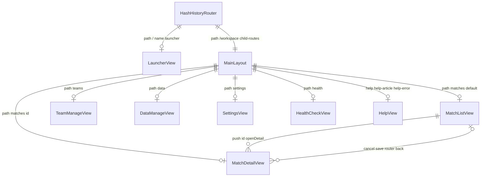
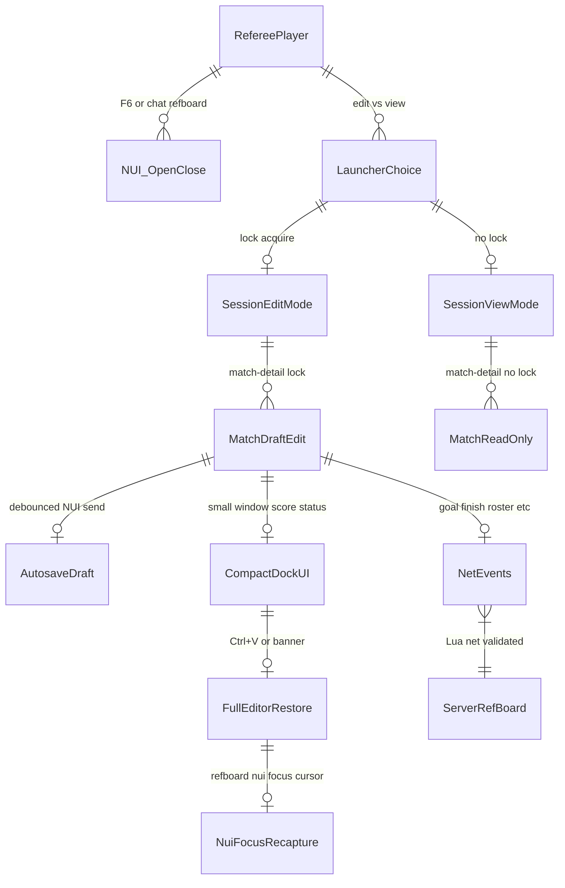

# RefBoard 開発日記 — 2026-05-06

**記録日時**: 2026-05-06（JST） / スプリント5完了・v0.5.0 リリース作業

## 実施内容（v0.5.0 / Sprint 5）

着手順: 5-1 → 5-3 → 5-2 → 5-4 → 5-5 → 5-6 → 5-7。

- **DB**: `sql/migration_004_team_roster.sql`（`team_roster`、`teams.emblem_emoji`）。`sql/install.sql` へ同期。
- **サーバー**
  - `server/team.lua`: 管理一覧・詳細・作成/更新/論理削除、ロスター CRUD。
  - `server/data.lua`（新規）: チーム統計・選手統計（license / ゲストキー集約）・スコア手動編集ログ・試合履歴フィルタ。
  - `server/player.lua`: `refboard:player:add_from_roster`（license 照合で `server_id`、オフライン時は 0）。
  - `server/event.lua`: `evaluatePenaltyShootout`、決着時 `refboard:event:pk_decided` を `-1` ブロードキャスト。
- **クライアント**: `nui_callback.lua` / `main.lua` に上記＋データ系 ACK の NUI 転送を追加。
- **NUI**
  - `TeamManage.vue` + `components/team/*`、`DataManage.vue`（4 タブ）、`Settings.vue` + `stores/settings.ts`（`localStorage`）。
  - `utils/exporters.ts`（BOM 付き CSV、試合 JSON）。`MatchDetail` ヘッダに JSON / イベント CSV エクスポート。
  - `AddPlayerDialog.vue`: サーバー ID / ロスター切替。`PenaltyShootoutPanel.vue`: PK 決着オーバーレイ → 試合終了確認。
  - `useKeyboardShortcuts` / `Toast` / `main.ts` の `errorHandler`。`onClickOutside` を `EventTimelineCard` / `ScoreBoardCard` に適用。
  - ルート: `/workspace/teams`, `/workspace/data`, `/workspace/settings`。`MainLayout` サイドバーと v0.5.0 表記、`Launcher.vue` バージョン。
- **モック**: `mocks/nuiMock.ts` に新 NUI パスと `maybeEmitPkDecided()`、ロスター・データ系の擬似 ACK。
- **ドキュメント**: `docs/USER_GUIDE.md` / `USER_GUIDE.en.md`、`docs/sprints/sprint_05.md`、`docs/screenshots/01`〜`10`（プレースホルダ PNG）、`README` / `README.en` ヒーロー・インストール文面、`CHANGELOG` v0.5.0。
- **ビルド・納品**: `web` で `npm run build` 成功。`RefBoard/` のみ git コミット・push（例: `6e45cbb`）。

## メモ

- プレースホルダスクリーンショットは後から実機キャプチャへ差し替え可。
- 「全メニュー外部クリック」は現状ドロップダウン2箇所。同パターンが増えたら `onClickOutside` を同様に足す。
- 既存 DB へは `migration_004` の単独実行を忘れない（`emblem_emoji` の ALTER は二重実行に注意）。

## 次スプリント候補（v0.9.0 方面）

- 非同期 UI のローディング統一、残ドロップダウンの外部クリック。
- `ScoreEditDialog` と設定ストアの「理由最小文字数」連動。
- 実機スクリーンショット差し替え・ベータ運用フィードバック反映。

---

## 追記: 実機テスト前夜（v0.5.1 / トリアージ強化）

**目的**: 明日の実機で問題が出たとき、**エラーコード・ログ・NUI トレース・ヘルスレポート**で原因を短時間で切り分けられるようにする。

- `shared/error_codes.lua` + 一部 ACK を `MakeError` 形式へ（`duplicate_license`、スコア系の `bad_payload` / `no_lock` / `tx_failed` 等）。
- `Logger` / `RefboardGuard`、主要 NetEvent のガード、`refboard:health:check`、NUI 通信トレース、`Launcher` のトレース有効化リンク。
- ドキュメント: `docs/sprints/sprint_06_pretriage.md`、`CHANGELOG` v0.5.1。

---

## 追記: エラーハンドリング設計の文書化

- **`docs/error_handling.md`**（新規）: `ErrorCodes` / `MakeError`、`RefboardGuard`、`Logger`、NUI（型・i18n・トレース・グローバルハンドラ）、拡張時のチェックリストを設計として固定。
- 実装の単一情報源は引き続き **`shared/error_codes.lua`** と **`server/util.lua`**。ドキュメントはそれらの意図と運用ルールを日本語で説明する。

---

## 追記: アプリ内ヘルプ機能の設計記録（v0.6.0 予定）

- **`docs/help_system_design.md`**（新規）: ツリー／逆引きの2タブ、レイアウト、記事フォーマット、`web/src/help/{ja,en}` のデータ構造、Fuse.js 検索、コンテキスト `?`、Toast からエラー別ヘルプ、v0.6〜v0.8 のフェーズ分割、**B案ロードマップ**（ヘルプ先行→実機テスト）を整理。
- **`docs/sprints/sprint_07.md`**: スプリント境界と受け入れ基準の要約（詳細は設計書へ）。
- **`docs/sprints/sprint_07_uiux_findings.md`**: 執筆中の UI/UX 気づき用の空テンプレート（v0.9.1 の改善ネタ用）。
- **`README.md` / `README.en.md`**: 上記へのリンクとステータス行（v0.6.0 計画）を追加。
- **`docs/error_handling.md`**: ヘルプとの連携節を追記。

---

## 追記: v0.6.0 Phase 1（アプリ内ヘルプの実装着手）

設計書どおりに全部は届かず、**土台＋緊急系記事 4 本＋エラー連携**までを先にマージした。

- `HelpView.vue`、`/workspace/help` 系ルート、サイドバー「ヘルプ」、`marked` + `dompurify`。
- `web/src/help/ja/` に逆引き JSON と記事 4 ファイル。`errorCodeMapper.ts` は Lua の `ErrorCodes` とキー／コードを一致させ、Toast から `help-error` へ（現状は E1003 / E4003 の専用記事のみ）。
- スプリント 07 は **進行中**として `sprint_07.md` に明記。残りは記事本数・Fuse.js・コンテキスト `?`・英語版など。

CHANGELOG v0.6.0 に未完了タスクも短く書いておき、後続の Cursor セッションで迷子にならないようにした。

---

## 追記: Sprint 08 マーキー設計の固定（v0.6.1 フェーズ1前・ドキュメントのみ）

### 【技術情報】

- **計測**: マーキーが必要かどうかは、先頭の 1 本の `span`（`contentRef`）の **`scrollWidth` のみ**で判定する。クローンの有無で `scrollWidth` がぶれないようにする。コンテンツ間の余白は **`padding-right` で gap を表現**し、移動量 `distance = 幅 + gap` を一意にする。
- **ResizeObserver**: **コンテナとコンテンツ（先頭 span）の両方**に張り、Web フォント適用後などレイアウト確定後に再計測する。
- **`variant` プリセット**: `default` / `scoreboard` / `ticker` / `subtle` を **`VARIANTS` 定数 1 箇所**に集約し、フェーズ 2 の置換では「どの画面にどの variant か」を表で固定する。後から速度だけ触りたいときも定数を変えれば横断反映できる。
- **案 A の UX**: スコアボードは凝視時間が長いので **`scoreboard` は 28 px/s・delay 2200 ms** とし、最初に陣営と数字を読んでから流れ始めるリズムにする（初期値であり実機で微調整可）。

### 【発生した問題と解決方法】

- **問題**: 初期案の `checkOverflow` で、`scrollWidth` を `isOverflowing` の状態に応じて割る書き方だと、**初回判定が不安定**になり得る（クローン有無と相互依存）。
- **解決**: **常に先頭 span だけで幅を測る**方式に寄せ、オーバーフロー確定後にのみ 2 本目を描画する流れを設計の正として固定した。
- **問題**: スコアボードのチーム名で「**省略（ellipsis）** と **マーキー全文** のどちらを標準にするか」がブレると、ブランドと実装の両方で手戻りが出る。
- **解決**: **案 A（オーバーフロー時は常時マーキーで全文）** をユーザー判断で確定。短い名前は **`isOverflowing === false` で静止**のままにし、長い名前だけ LED 主役のマーキーに振る分岐を明文化した。

### 【全体の実施した内容】

- `docs/sprints/sprint_08_marquee.md` に、スコアボード適用方針（案 A）の **確定理由・推奨数値・適用ファイル・ホバーはローカルのみ・score-flash 連動・scorer-name-marquee** を、既存の「スコアボード適用方針」節へ統合・補強した。
- 同ファイルに **`VARIANTS` の TypeScript 表現**、各 variant の **用途指針**、**フェーズ 2 置換時の variant 割り当て表**、プリセット数値が **初期値（実機テスト後に `VARIANTS` のみ調整可）** である旨の注記を追加した。
- **フェーズ 1 着手前チェックリスト**（vue-tsc 先行、`MarqueeText` に variant、ディレクティブ引数、`marquee.css` と `data-marquee-mode`）を sprint 文書末尾に追加した。
- `CHANGELOG.md` に **v0.6.1 — Unreleased** を新設し、上記設計確定を 1 行で記録した（**本コミットは実装コードに手を入れていない**）。
- **次の一手**: vue-tsc 緑化の単独コミット → Sprint 08 フェーズ 1（`MarqueeText` / `v-marquee` / 設定 / CSS 基盤の実装）。

---

## 追記: vue-tsc 緑化（Sprint 08 フェーズ1前・chore）

### 【技術情報】

- **`vue-tsc --noEmit`**: Vue SFC と `<script setup>` を含む TypeScript をコンパイルのみで検査し、**本番ビルド前に型不整合を検出**する。RefBoard ではマーキー等の横断変更時に「新規エラーか既存エラーか」を分けるため、**ベースラインを緑にしておく**運用とした。
- **未使用変数**: `noUnusedLocals` に従い、**参照が無く将来の意図もコメントに無いものは削除**する。将来 PK 決着ロジックで先攻チーム ID が必要になった場合は、その時点で `nextTeamId` と同様に **意味のある名前で再導入**すればよく、先読みの `_` プレフィックスは不要と判断した。
- **`nuiMock` の型**: 一覧行の `status` は `as const` により **`"draft"` リテラル単独**に狭まっており、`match_finish` での `'finished'` 代入が拒否されていた。**` 'draft' | 'finished' ` へ拡張**して実際の遷移と一致させた。`match_name` / `venue` / `kickoff_time` は **DB 由来で null の可能性**があるが、モック一覧の型は `string` のため **`String(... ?? '')`** で空文字に正規化し、`any` には落とさなかった。

### 【発生した問題と解決方法】

- **問題1**: `PenaltyShootoutPanel.vue` の `pkDecided` 計算内で **`first` を宣言していたがループ・判定で未使用**（`nextTeamId` 側の `first` と混同した残骸と推定）。**行ごと削除**し、テンプレート・他 computed への参照は無いことを目視確認した。
- **問題2**: `nuiMock.ts` で **`string | null` を一覧行の `string` フィールドに代入**していたほか、**`mockListRows` の `status` が `'draft'` リテラルのみ**で `row.status = 'finished'` が型エラーになっていた。**null は空文字列へ**、**status は `'draft' | 'finished'`** に修正した。
- **挙動確認**: 変更は未使用行の削除とモックの **型整合のみ**であり、UI の分岐条件・`postNui` のキーは変えていない。`npx vue-tsc --noEmit` と **`npm run build` の成功**でビルドパイプライン上の破綻が無いことを確認した（`dist/` はコミット対象外のためビルド後に restore）。

### 【全体の実施した内容】

- Sprint 08 フェーズ1着手前の **地ならし**として、`vue-tsc` 報告済みの **2 ファイル・計 4 エラー**を解消した。
- **`PenaltyShootoutPanel.vue`** から未使用の `first` を削除。**`nuiMock.ts`** は新規試合行のメタ文字列を `String` で正規化し、既存モック行の `status` 型を **`'draft' | 'finished'`** に広げた。
- **`CHANGELOG.md` は触れず**（chore のため）、コミット対象は上記 2 ファイルと本日記のみとした。
- **次の一手**: Sprint 08 フェーズ1（`MarqueeText` / `v-marquee` / `settings.marqueeMode` / `marquee.css`）の実装へ進む。

---

## 追記: Sprint 08 フェーズ1（マーキー基盤実装）

### 【技術情報】

- **計測**: `MarqueeText` はオーバーフロー判定に **常に「現在表示している 1 行 span」の `scrollWidth` のみ**を使い、クローン有無で幅がぶれないようにした（設計書の `contentRef` に相当する `measureRef` をテンプレートの分岐ごとに 1 系統だけ存在させる）。**`--marquee-distance`** はその `scrollWidth` をそのまま使い、**`--marquee-gap`** は `resolveMarqueeTiming` の `gap` をトラックの CSS 変数に載せて `.rb-marquee-content` の `padding-right` と連動させた。
- **VARIANTS**: 設計書の数値を **`utils/marqueeVariants.ts` に単一化**し、`MarqueeText` と `v-marquee` の両方から `resolveMarqueeTiming` を呼ぶ。フェーズ2以降の置換では variant 名だけ選べばよく、**微調整はファイル 1 箇所**で済む。
- **`data-marquee-mode` + CSS**: ルート（`App.vue`）に属性を出し、**`always` / `hover-only` / `off`** は `marquee.css` のセレクタで **`animation-play-state` と省略スタイル**を切り替える。ランタイムで `getComputedStyle` を触ってアニメを組み立て直す方式は取らず、**設定変更は属性と再描画に任せる**方針にした。
- **`provide('marqueeMode')`**: `MarqueeText` が祖先の属性を毎回 `closest` しなくてよいよう、**同じ値を ComputedRef で inject** し、`off` 時はテンプレートを **マーキー用トラック／省略用 1 行／素の 1 行**の三系統に切り替えて挙動を明示した。
- **ResizeObserver**: コンテナ幅とテキスト幅の両方が変わり得るため、**コンテナと `measureRef` の両方**を observe し、`props` / `marqueeMode` 変更後は `disconnect` してから張り直す `setupRo()` で追従させた。
- **`prefers-reduced-motion`**: **CSS `@media`** でトラックのアニメとマスクを止めるほか、`settings.load()` で **localStorage に `marqueeMode` が無い場合のみ**初期値を `off` に落とし、ユーザーが既に保存している値は上書きしない。

### 【発生した問題と解決方法】

- **問題**: ディレクティブで **`innerHTML` に文字列を流し込む**と XSS と Vue 子ノード破壊のリスクが残る。  
- **解決**: **`document.createElement` + `textContent` + `appendChild`** で `rb-marquee` 構造を組み立て、`ResizeObserver` と `applyLayout` で **クローン span の付け外し**とインラインの `--marquee-distance` / `animation-duration` のみ更新した。`off` + オーバーフロー時は **`rb-marquee-track-ellipsis`** クラスでトラックを 1 行省略に切り替え、`MarqueeText` の省略分岐と見た目を揃えた。
- **問題**: `MarqueeText` の `off` 省略スタイルが **`[data-marquee-mode='off']` セレクタにだけ依存**すると、将来テスト用に属性を外した場合に効かない可能性があった。  
- **解決**: **`.rb-marquee--ellipsis .rb-marquee-off-text`** にも同じ省略ルールを並記し、クラスベースで最低限効くようにした（属性は従来どおり推奨）。
- **迷い**: `text-overflow: ellipsis` を **設定「停止」時のみ**に限定し、案 A の「常時マーキー」本体とは **設定 UI の文言どおり**両立させた。フェーズ2で `ellipsis` を全廃する grep は、**停止モード以外では使わない**前提で進める。
- **特筆すべき型エラー**: 実装中に `vue-tsc` が新規で落ちることはなく、**`Directive<HTMLElement, …>`** でホスト型を固定した。

### 【全体の実施した内容】

- Sprint 08 **フェーズ1（マーキー基盤）**として、`MarqueeText.vue`、`directives/marquee.ts`、`styles/marquee.css`、`utils/marqueeVariants.ts` を新規追加し、`main.ts` で **`marquee.css` の import** と **`v-marquee` 登録**を行った。
- **`stores/settings.ts`** に `marqueeMode` を追加し **`localStorage` 永続化**、`Settings.vue` の「表示」に **ラジオ 3 択**、`ja.json` / `en.json` に **`settings.marquee_mode.*`** を追加した。`App.vue` で **`data-marquee-mode` と `provide('marqueeMode')`** を配線した。
- **`CHANGELOG.md`（v0.6.1 Unreleased）** と **`docs/sprints/sprint_08_marquee.md`**（フェーズ1進捗・チェックリスト消化・関連ファイル表）を更新した。
- **`npx vue-tsc --noEmit` / `npm run build` は成功**。既存の試合 UI には **Marquee をまだ組み込んでいない**（フェーズ2でサイドバー・ヘッダー・ヘルプ・トースト・スコアボードへ適用予定）。
- **次の一手**: フェーズ2（高視認エリアへの `MarqueeText` / `v-marquee` 置換と、必要なら簡易デモ画面での目視確認）。

---

## 追記: Sprint 08 フェーズ2a（スコアボードのチーム名のみマーキー）

### 【技術情報】

- **対象パス**: 設計書どおり **`web/src/components/match/ScoreBoardCard.vue`**（他ファイル名への差し替えは不要だった）。従来のチーム正式名は **`
{{ model.home.name }}
`**（アウェイ同型）で、**`truncate` / `text-overflow: ellipsis` / `line-clamp` は未使用**だったため削除対象は無し。
- **置換**: ホーム・アウェイそれぞれを **`w-full min-w-0 max-w-full text-center text-xs font-medium text-slate-300`** のラッパー 1 段で包み、その内側に **`<MarqueeText :text="model.home.name ?? ''" variant="scoreboard" />`** を配置した。`:deep()` は不要（色・字サイズはラッパーから継承）。**`flex-1` 列の子に `min-w-0`** を付けて、flex アイテムのデフォルト `min-width: auto` による **scrollWidth 計測不良**を避けた。
- **scoreboard variant の数値感**: 実装は **`marqueeVariants.ts` の scoreboard（speed 28 / delay 2200 / gap 64）**をそのまま利用。**Cursor 実行環境ではブラウザで localhost を連続操作して a〜f を目視できない**ため、「適切」「違和感」の**体感判定は保留**とする。`npm run dev` は **Vite が正常起動**することまで確認。**本コミットでは `marqueeVariants.ts` は変更しない**。担当者がローカルで試合詳細を開き、長短チーム名・Settings の `marqueeMode` 切替・ホバー停止を確認したうえで、必要なら **次コミットで VARIANTS のみ**調整する。

### 【発生した問題と解決方法】

- **レイアウト**: 現時点で **レイアウト崩れや型エラーは未発生**（`vue-tsc` / `npm run build` 成功）。チーム名列はもともと `flex-1` の縦積み中央寄せのため、**横幅の制約は `min-w-0` で明示**したのみ。
- **フォント継承**: 旧実装と同じ **`text-xs font-medium text-slate-300`** をラッパーに残し、`MarqueeText` 内の `rb-marquee-plain` / `rb-marquee-content` 等が **継承で同色・同階層の字重**になるようにした。
- **特筆すべき問題なし**: 共有のグローバル CSS を変更せず、**`ScoreBoardCard.vue` ローカルのみ**置換した。

### 【全体の実施した内容】

- Sprint 08 **フェーズ2a（スコアボード単体）**として、**`ScoreBoardCard.vue` のホーム・アウェイ正式名 2 箇所のみ**を **`MarqueeText` + `variant="scoreboard"`** に差し替えた。スコア数字・時計・ゴールボタン・略称アバター・`score-flash` は **未変更**（フェーズ3）。
- **`CHANGELOG.md`（v0.6.1 Unreleased）** に 1 行、**`docs/sprints/sprint_08_marquee.md`** に「フェーズ2a 完了」節と改版履歴を追記した。
- **`npx vue-tsc --noEmit` / `npm run build` 成功**。**`npm run dev`** は起動スモークのみ（`http://localhost:5173/` 表示まで）。**a〜f の目視チェックリストは担当者のローカル実施を推奨**（体感評価は上記のとおり保留）。
- **scoreboard variant 数値感の結論**: **体感は未判定のため据え置き**（調整コミットは実機確認後に判断）。**次の一手**: フェーズ2b（サイドバー・ヘッダー・ヘルプ・トースト）**または**、目視後に **`marqueeVariants.ts` の scoreboard 行のみ**を触るチューニングコミット。

---

## 追記: 試合詳細 UI（小窓・背景・日付入力・NUI フォーカス）

**記録**: 会話ベースの実装まとめ（コミットは `main` 上の RefBoard のみ）。

### 【技術情報】

- **試合一覧スコア（モック）**: `nuiMock.ts` で `score_goal` / `score_manual_edit` 後に `mockListRows` の `team1_score` / `team2_score` を `liveDetail` に同期（`syncMockListRowScoresFromLive`）。詳細から一覧へ戻ったときの再取得は `MatchList.vue` の `router.afterEach` でも補強。
- **小窓モード**: 各カードの ▲ 折りたたみ（`MatchDetailSection.vue`）は撤回し、**画面下部固定**で **スコア＋試合ステータス**のみ表示。左上に **Ctrl+V** で全画面復帰の黄帯（クリックでも復帰）。`compactDock` 時はルートに `pointer-events-none`、ドックと黄帯とモーダルラッパーは `pointer-events-auto`。PK 中は全画面優先で小窓オフ。
- **ドック位置**: `bottom-4` / `sm:bottom-5` と左右 `inset`。`ScoreBoardCard` の `embed` 時は **⋯ メニューを `bottom-full`（上向き）** にしてクリップ回避。
- **背景画像**: `App.vue` で `image/back.jpg` を import。**`settings.showBackgroundImage`（既定 `false`）**で ON のときのみ写真＋`slate-950/78` オーバーレイ。OFF 時は単色 `rgb(15 23 42 / 0.88)`。設定「表示」にチェック＋説明（`ja` / `en`）。
- **日付・時刻**: `readonly` + `showPicker()` は **非 mutable で `showPicker` が例外**になるため撤回。**`blockDateTimeFieldKeydown` + `paste`/`drop` 抑止**で直打ちを抑え、`click` / `Enter` で `showPicker()`。カレンダーアイコンの **`filter` は撤去**（視認性のため）。`accent-color` / `color-scheme` と WebKit インジケータの `opacity` のみ。
- **視認性**: アンバー／警告系の **`text-slate-900` を `text-white drop-shadow-sm`** に変更（複数画面）。日付系入力に `text-slate-100` 等。
- **小窓解除とマウス**: `refboard:nui_focus_cursor` NUI コールバック（`main.lua`）で **`SetNuiFocus(true, true)` 再適用**。Web は `refboardRecaptureNuiFocus()` を `fetch`。`MatchDetail` で `compactDock` が **true→false** のとき `nextTick` → 再フォーカス → **`fullEditorAnchorRef`（`tabindex=-1`）へ `focus({ preventScroll: true })`**。

### 【発生した問題と解決方法】

- **問題**: オーバーレイ `/65` で UI が背景に埋もれ「見えない」ように感じられた → **`/78` に戻し**、コンテンツ側に **`z-10`**。
- **問題**: `readonly` 付きで `showPicker` が無反応 → **readonly 撤去**とキー抑止の組み合わせへ変更。
- **問題**: 小窓復帰後もゲーム側にマウスが残る → **Lua で NUI フォーカス再適用**＋DOM フォーカス。

### 【全体の実施した内容】

- 削除: `MatchDetailSection.vue`（方針転換のため）。
- 新規・主な変更: `openNativeDateTimePicker.ts`、`MatchDetail.vue`（小窓・フォーカス）、`main.lua`（NUI コールバック）、`useNui.ts`（`refboardRecaptureNuiFocus`）、`settings.ts` / `Settings.vue` / `App.vue`、`main.css`（`.refboard-input-pickers`）、`BasicInfoCard` / `CreateMatchDialog` / `DataManage` / 各種ボタン、`ScoreBoardCard`（メニュー位置・`embed`）、`ja.json` / `en.json`（`match_detail.*` / `settings.show_background_image` 等）、`dist` 同梱ビルド。
- **`docs/sprints/sprint_07_uiux_findings.md`**: 選手状態タップ切替は未実装メモ（過去追記の可能性あり）。

### 【次の一手（任意）】

- 小窓中の `SetNuiFocusKeepInput` 検討（ゲーム視聴との両立が要件なら）。
- 背景 ON 時のオーバーレイを設定スライダー化。
- 日付ピッカー: 環境によっては `showPicker` 非対応のため、フォールバック UI の要否を実機で判断。

---

## 追記: 画面遷移・ユーザー操作（ER 図）

**前提**: NUI は **hash ルーティング**（`#/`, `#/workspace/...`）。図は **Mermaid `erDiagram`**（GitHub / エディタの Mermaid プレビューで表示。素の Markdown ではソースのまま）。

### 画面遷移構成（ルートとレイアウトの関連）

`web/src/router/index.ts` の親子に対応。`MainLayout` がサイドバー＋`RouterView` を保持し、子は排他的に 1 画面。

**読み方**: `||--o|` は「1 対 0..1」「`||--||`」は常に子レイアウトがぶら下がる親、`||--o{` は同一コンポーネントが複数ルート名で再利用（`HelpView`）。

### ユーザー操作（アクターとリソースの関連）

審判プレイヤー視点。FiveM クライアントは NUI 開閉と `SetNuiFocus` を握る。

**読み方**: ユーザーは **NUI 操作**を通じて **セッション種別**と **試合編集 UI** に結び付く。小窓解除は **NUI フォーカス再取得**（クライアント）と **DOM フォーカス**（Web）の両方を経由する、という関連を明示した。
