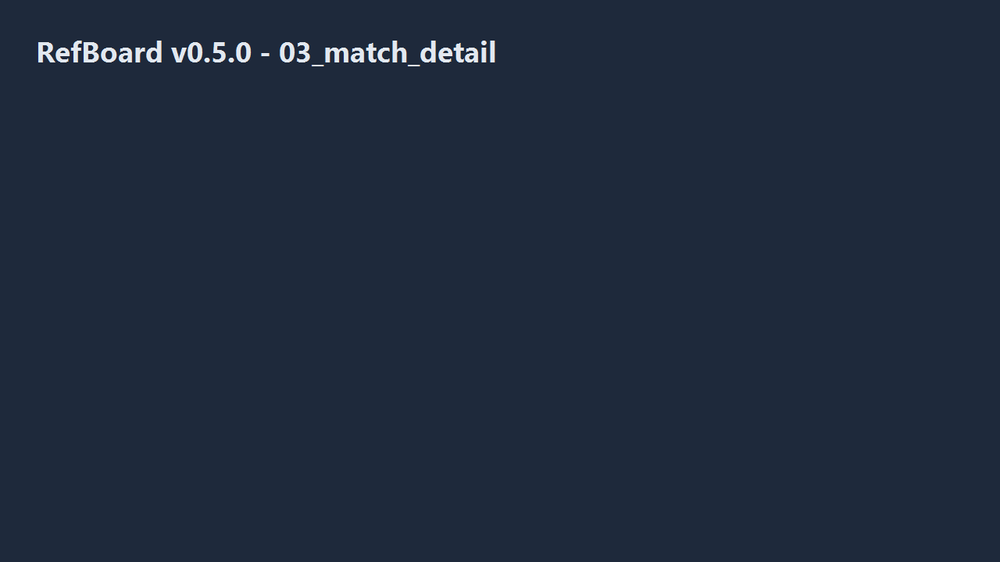

<div align="center">



<p><em>Soccer match control — simple and safe.</em></p>


# RefBoard

**Open-source soccer match management for FiveM — tamper-evident score history, edit lock, JA/EN UI.**

[日本語](./README.md)

[](LICENSE)

</div>

---

## Overview

RefBoard lets **referees / staff** record match scores, clock, and rosters with **MySQL as the source of truth**. It targets a **single-editor lock** and **append-only score history** (see `docs/01_database.md`).

- **Resource folder**: `RefBoard` (`ensure RefBoard`)
- **Dependency**: [oxmysql](https://github.com/overextended/oxmysql)
- **Edit mode**: enter the password from `Config.EditPassword` in `config.lua` (default `ref`) on the launcher. View mode needs no password.

## Install

1. Copy this folder under `resources/.../RefBoard`.
2. Run `sql/install.sql` on your MySQL database (for local testing, also run `sql/seed_dev_teams.sql` for two sample teams). **Existing databases**: apply prior migrations and `sql/migration_004_team_roster.sql` (roster + emblem column).
3. Add `ensure RefBoard` after `ensure oxmysql` in `server.cfg`.
4. Grant `refboard.referee` to referee accounts (example: `add_ace identifier.license:xxxx refboard.referee allow`).

## Usage

- In game: **`/refboard`** or **`F6`** (see `Config.OpenKey`).

## Documentation index

### Design & architecture

| Doc | Summary |
|-----|---------|
| [docs/01_database.md](docs/01_database.md) | DB layout and relationships; canonical DDL in `sql/install.sql` |
| [docs/02_server.md](docs/02_server.md) | Server Lua, `refboard:` NetEvents and ACK flow |
| [docs/03_frontend.md](docs/03_frontend.md) | Vue 3 / Vite / NUI, `useNui`, routing |
| [docs/04_design_mockup.md](docs/04_design_mockup.md) | Screen mockups and early IA notes |
| [docs/error_handling.md](docs/error_handling.md) | Error codes (`ErrorCodes` / `MakeError`), `RefboardGuard`, `Logger`, NUI handling |
| [docs/help_system_design.md](docs/help_system_design.md) | **Planned v0.6.0**: In-app help (tree + task index, search, context `?`, toast → help for errors) |

### Testing & quality

| Doc | Summary |
|-----|---------|
| [docs/testing/release_test_plan.md](docs/testing/release_test_plan.md) | Pre-release on-device test plan (phases / scenarios) |
| [docs/testing/test_results.md](docs/testing/test_results.md) | Template for recording test runs |
| [docs/testing/known_issues.md](docs/testing/known_issues.md) | Known bugs and workarounds |
| [docs/testing/transaction_test.md](docs/testing/transaction_test.md) | DB transaction verification (`Config.EnableTestCommands`) |

### Sprint notes (context for changes)

| Doc | Summary |
|-----|---------|
| [docs/sprints/sprint_02.md](docs/sprints/sprint_02.md) | ~v0.2.0: match list/create, lock, autosave |
| [docs/sprints/sprint_03.md](docs/sprints/sprint_03.md) | ~v0.3.0: `match:get`, score, players, finish/reopen |
| [docs/sprints/sprint_04.md](docs/sprints/sprint_04.md) | ~v0.4.0: subs, cards, PK, presence focus |
| [docs/sprints/sprint_05.md](docs/sprints/sprint_05.md) | ~v0.5.0: teams/roster, data hub, settings, PK UI |
| [docs/sprints/sprint_06.md](docs/sprints/sprint_06.md) | Toward v0.9.0: hardening, on-device QA plan |
| [docs/sprints/sprint_06_pretriage.md](docs/sprints/sprint_06_pretriage.md) | v0.5.1: pre-test triage (observability, guards, health) |
| [docs/sprints/sprint_07.md](docs/sprints/sprint_07.md) | **Planned v0.6.0**: In-app help sprint (acceptance criteria, roadmap plan B) |
| [docs/sprints/sprint_08_marquee.md](docs/sprints/sprint_08_marquee.md) | **v0.6.1**: Marquee typography rollout (separate from Sprint 07; 3-phase PR plan) |
| [docs/sprints/sprint_07_uiux_findings.md](docs/sprints/sprint_07_uiux_findings.md) | UX notes while writing help (input for v0.9.1 fixes) |

### Changelog & user-facing

| Doc | Summary |
|-----|---------|
| [CHANGELOG.md](CHANGELOG.md) | Version-by-version release notes |
| [docs/USER_GUIDE.md](docs/USER_GUIDE.md) | Operator / referee guide (Japanese) |
| [docs/USER_GUIDE.en.md](docs/USER_GUIDE.en.md) | Same (English) |

## UI development

```bash
cd RefBoard/web
npm install
npm run dev
```

Production: `npm run build` outputs to `web/dist`.

## Status

**v0.6.0 (planned)** — In-app help (topic tree + task-based index, search, `?` on key screens, errors link to help). Spec: [docs/help_system_design.md](docs/help_system_design.md), sprint: [docs/sprints/sprint_07.md](docs/sprints/sprint_07.md). **Plan B**: ship help before full on-device QA.

**v0.5.1** — On-device triage: `ErrorCodes` / `MakeError`, `Logger`, `RefboardGuard`, NUI request trace, health check. See `docs/error_handling.md` and `docs/sprints/sprint_06_pretriage.md`.

**v0.5.0** — Team management + roster, data hub + CSV export, settings (localStorage), PK decided flow, UX polish, screenshots + user guides. `docs/sprints/sprint_05.md`.

**v0.3.0** — Goal wizard, add player, manual score + history dialog, finish/reopen match, real `match:get` / `match:state`, NUI mocks for `npm run dev`. Sprint: `docs/sprints/sprint_03.md`.

**v0.2.0** — Match list + create, `MatchDetail` mock, editor lock, autosave. `docs/sprints/sprint_02.md`.

**v0.1.1** — Presence (option A), design doc 04, match meta columns.

**v0.1.0** — Initial scaffolding.

## License

MIT — see [LICENSE](LICENSE).
