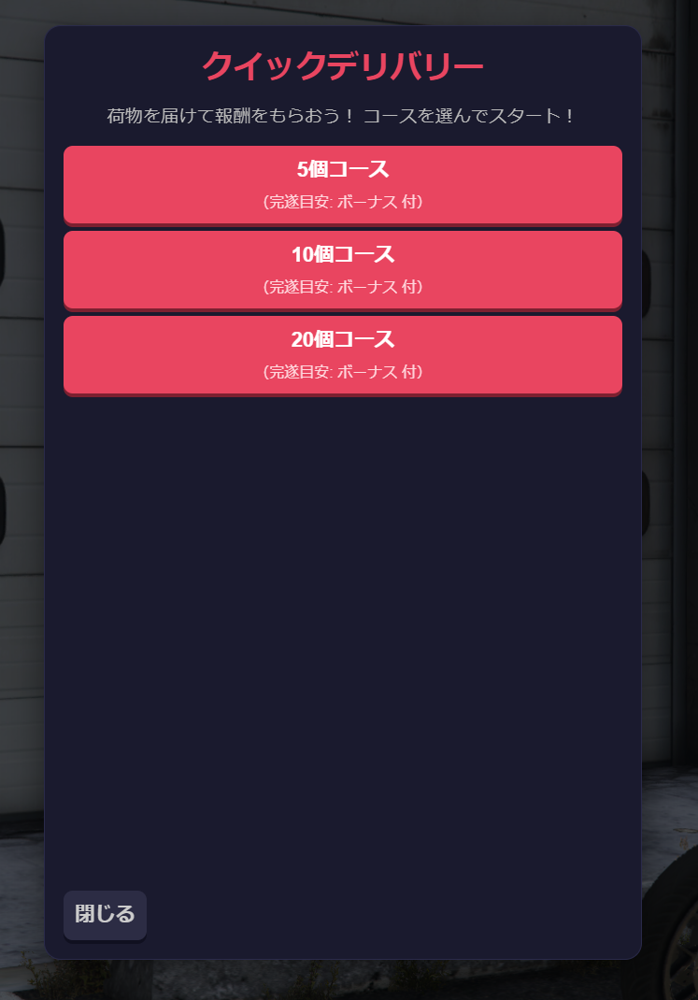
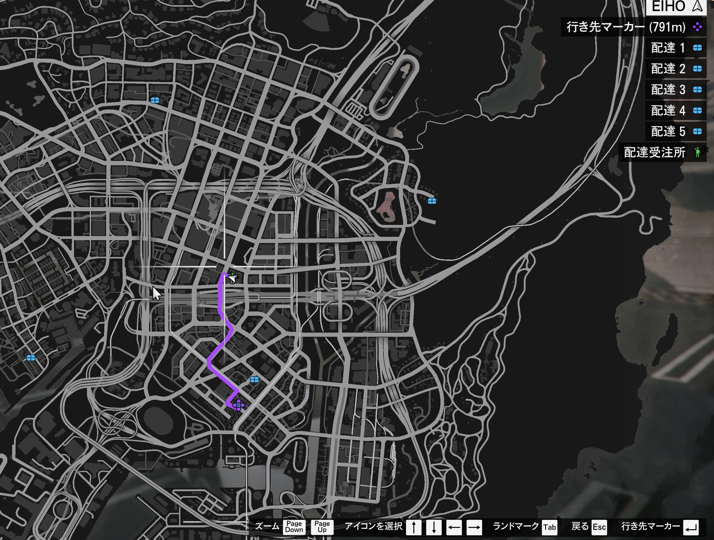
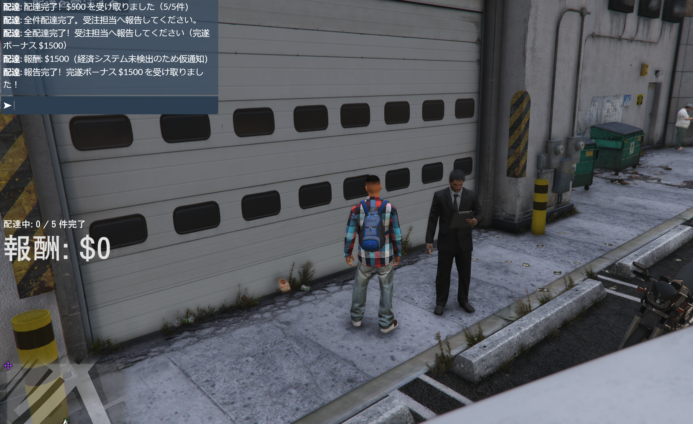

# jp-LetterCarrier

初心者でも導入しやすい、FiveM 向けのスタンドアロン配達ジョブです。  
ESX / QBCore がなくても動作し、あれば自動で報酬付与に対応します。

---

## 1. 何ができるMOD？

- 受注NPCに話しかけて配達ジョブを開始
- コース（5件 / 10件 / 20件）を選択
- 受注と同時に「積み込み済み」扱いで配送開始
- 配達先は好きな順番で回れる
- 全件配達後、受注NPCに報告して完了ボーナス受け取り
- 受注時に配送車（小型バン）を自動スポーンして乗車

---

## 2. インストール手順（最短）

1. `jp-LetterCarrier` フォルダを次へ配置  
   `resources/[jp-mods]/jp-LetterCarrier/`
2. `server.cfg` に追加  
   `ensure jp-LetterCarrier`
3. サーバーを再起動  
   （または `refresh` → `ensure jp-LetterCarrier`）

---

## 3. プレイヤー向けの使い方

1. マップの **「配達受注所」** ブリップへ行く
2. NPCの近くで `E` → コース選択
3. 配送車に乗って配達先へ向かう
4. 配達先の青マーカー近くで `E` で配達
5. 全件終わったら受注NPCへ戻って `E` で報告

> `/delivery`（または `/delivary`）でも受注メニューは開けます。

---

## 4. 今の仕様（大事）

- 配達先は受注時点で全件有効（順番自由）
- 最寄り配達先に自動ナビ（消えたら自動復旧）
- 報酬表示は画面左に常時表示
- 通知はチャットに表示
- 配達1件ごとの報酬は即時
- 完遂ボーナスは「受注NPCへの報告時」に付与

---

## 5. 設定（`config.lua`）

よく触る項目だけ覚えればOKです。

- `Config.RewardPerDelivery`  
  1件あたりの報酬
- `Config.CompletionBonus5 / 10 / 20`  
  コース完了時のボーナス
- `Config.JobPedModel`  
  受注NPCモデル
- `Config.JobPedCoords`  
  受注NPC位置（`vector4(x, y, z, heading)`）
- `Config.DeliveryVehicleModel`  
  受注時に出す配送車（例: `speedo`）
- `Config.OpenCommand`  
  受注UIを開くコマンド（既定 `delivery`）
- `Config.DeliveryLocations`  
  配達候補座標リスト

---

## 6. NPCを置きたい場所の座標取得

このMODには `/getpos` コマンドが入っています。  
置きたい場所に立って `/getpos` を打つと、チャットとF8に次が出ます。

`vector4(x, y, z, heading)`

その値を `Config.JobPedCoords` に貼り付けてください。

---

## 7. よくあるトラブル

- **NUIが開かない**  
  `ensure jp-LetterCarrier` 済みか、F8エラー確認
- **受注NPCが変な位置に出る**  
  `/getpos` で再取得して `Config.JobPedCoords` を更新
- **報酬が入らない**  
  ESX/QBCore の有無とサーバーログ確認  
  （非導入時はフォールバック通知）
- **配達できない地点がある**  
  `Config.DeliveryLocations` の座標を見直し

---

## 8. ライセンス

MIT License

---

## 9. スクショ付きガイド（受注UI / マップ / 報告）
### 9-1. 受注UI

受注NPCに `E` で話しかけると、このメニューからコースを選びます。

### 9-2. マップ（配送中）

配達先ブリップとナビが表示され、好きな順で回れます。

### 9-3. 完了報告

全件配達後は受注NPCへ戻り、`E` で報告してボーナスを受け取ります。

