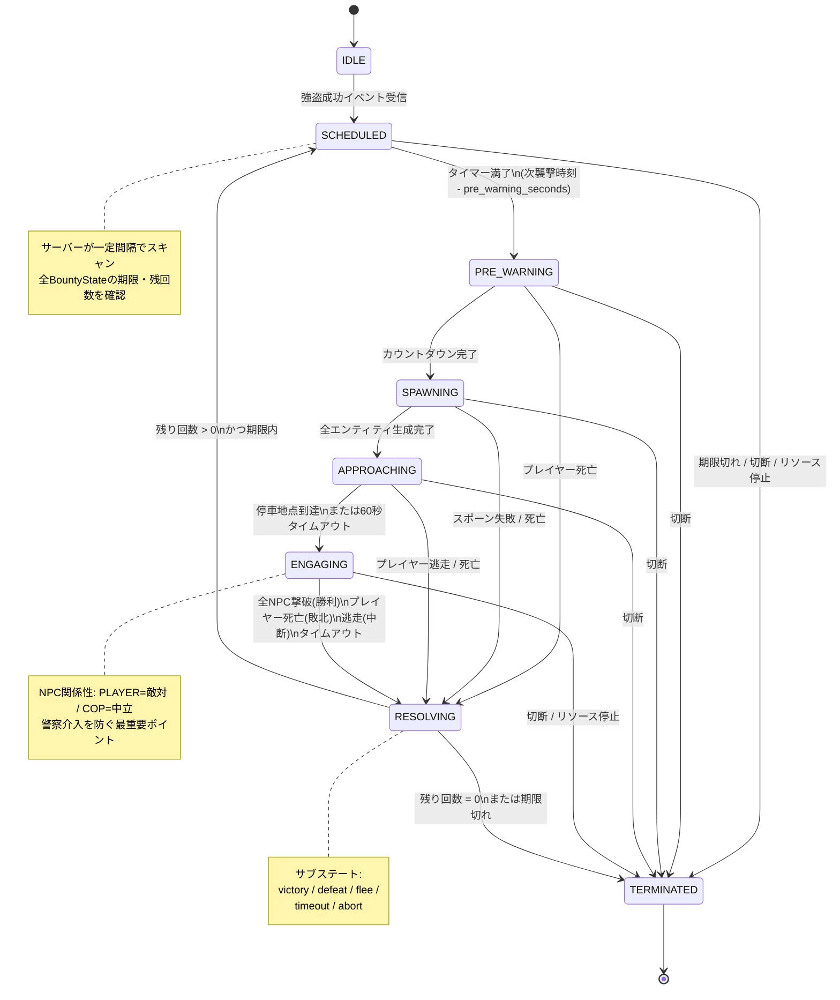

# 報復システム 状態遷移仕様書（Retaliation FSM）

**ファイル**: `docs/RETALIATION_FSM.md`  
**対象**: PHASE 4「闇の指名手配システム」実装  
**関連**: `docs/DESIGN.md`、`docs/PLAYER_FLOW.md`（シーン #21〜#28）、`docs/EVENT_HOOKS.md`、`config/retaliation.lua`  
**最終更新**: 2026-05-03（§13 追記）

---

## 1. 目的とスコープ

本仕様書は、jp-UnderworldBounty における「闇の指名手配（Underworld Bounty）」システムの状態管理を、**有限状態機械（Finite State Machine, FSM）として厳密に定義**する。

報復システムは本プロジェクトの最大の差別化機能であり、同時に最もバグが発生しやすい領域でもある（NPC残骸、永続化漏れ、警察介入の混入、リソース停止時のクリーンアップ漏れ）。FSMとして明文化することで、実装時の判断コストを最小化し、エッジケース漏れを防ぐ。

スコープは、強盗成功イベント受信から指名手配完全解除までの全ライフサイクル。プレイヤー 1 人につき 1 つの `BountyState` オブジェクトをサーバー側で管理し、各 `BountyState` が本 FSM に従って遷移する。

---

## 2. 設計原則

### 2.1 真実はサーバーにある（Server is the source of truth）

状態の正本（source of truth）は **サーバー側 `server/bounty.lua` のメモリ（および任意で DB）に保持** する。クライアントは演出（NPC のスポーン、車両の走行、戦闘描画）のみを担当し、状態遷移の決定権はサーバーが握る。

クライアントから「敵を全滅させた」「逃走した」「死亡した」のイベントは**事実報告**としてサーバーが受け取り、サーバーが**遷移可否を判定**する。クライアントが直接「次の状態へ進めてください」と要求することはない。

### 2.2 タイムアウトを全状態に設定する

各状態に**最大滞在時間（max_duration）**を必ず設定する。タイムアウト時は安全側にフォールバック（ENGAGING 強制終了 → RESOLVING、APPROACHING 詰まり → ENGAGING スキップ、等）する。これにより地形バグやネットワーク異常で FSM が詰まることを防ぐ。

### 2.3 副作用は遷移時にのみ実行する

NPC スポーン、イベント発火、DB 書き込みなどの副作用は、**状態遷移のタイミングでのみ**実行する。状態の途中で副作用を発生させない。これにより、リプレイやデバッグ時に副作用の発生箇所が明確になる。

### 2.4 全遷移をログ出力する

`Config.Debug = true` のとき、全状態遷移を以下のフォーマットでログ出力する：

`[UB:FSM] player=<id> bounty=<bountyId> <FROM_STATE> -> <TO_STATE> trigger=<trigger_name> wave=<n>/<max>`

本番運用では `INFO` レベルで主要遷移（IDLE→SCHEDULED、TERMINATED）のみ出力。

---

## 3. 状態定義

報復システムは以下の 8 状態を持つ。各状態の定義、入場条件、滞在中の挙動、退場条件、最大滞在時間、を定義する。

### 3.1 IDLE（待機）

**意味**: 指名手配が存在しない、または手配中で次襲撃のスケジュール前の初期状態。

**入場時の処理**: 状態オブジェクトの初期化、または前状態のクリーンアップ完了確認。HUD アイコン非表示。

**滞在中の挙動**: 何もしない。サーバーは強盗成功イベントを待機。

**退場条件**: 強盗成功イベント受信 → SCHEDULED へ。

**最大滞在時間**: 無制限。

**Config 関連**: なし。

---

### 3.2 SCHEDULED（襲撃予約済み）

**意味**: 指名手配が発動し、次の襲撃発生時刻が決定済み。タイマー稼働中。

**入場時の処理**: 次襲撃時刻を計算（`current_time + random(min_interval, max_interval)`）。タイマー登録。HUD アイコン点灯。公開イベント `jp-UnderworldBounty:onBountyTriggered` を発火（ペイロードは `docs/EVENT_HOOKS.md` に合わせる）。

**滞在中の挙動**: サーバーが一定間隔（`Config.bounty_scan_interval`／実装では `Config.BountyScanIntervalMs`）で全 `BountyState` をスキャン。指名手配の有効期限（`bounty_duration`）を過ぎていないかチェック、過ぎていれば TERMINATED へ。

**退場条件**:

- 次襲撃時刻 - `pre_warning_seconds` に到達 → PRE_WARNING へ
- 指名手配有効期限切れ → TERMINATED へ
- プレイヤー切断 → TERMINATED へ
- リソース停止 → TERMINATED へ

**最大滞在時間**: `Config.retaliation.max_interval_seconds`（デフォルト 45 分）。

**Config 関連**: `min_interval_seconds`、`max_interval_seconds`、`pre_warning_seconds`、`bounty_duration_seconds`。

---

### 3.3 PRE_WARNING（事前警告）

**意味**: 襲撃直前のフレーバー通知発動済み。プレイヤーに「視線を感じる…」等の警告表示。

**入場時の処理**: クライアントへ事前警告用イベント送信、フレーバー通知表示（ロケールキー例: `notify_retaliation_hint`／設計案 `_L('bounty.warning.presence')`）。

**滞在中の挙動**: 設定された秒数（`pre_warning_seconds`、デフォルト 30 秒）カウントダウン。

**退場条件**:

- カウントダウン完了 → SPAWNING へ
- プレイヤー死亡 → RESOLVING（敗北）へ
- プレイヤー切断 → TERMINATED へ

**最大滞在時間**: `pre_warning_seconds + 5秒`（タイムアウト時は強制的に SPAWNING へ）。

**Config 関連**: `pre_warning_seconds`、`pre_warning_messages[]`（複数パターンからランダム選択）。

---

### 3.4 SPAWNING（生成中）

**意味**: 報復 NPC と車両を生成中。視界外座標計算、エンティティ生成。

**入場時の処理**: クライアント側でプレイヤーから `spawn_distance`（デフォルト 150〜200m）離れた**視界外**座標を計算。地面の有効性チェック（水中・建物内・空中を除外）。失敗時は最大 3 回リトライ、それでも失敗ならフォールバック座標（プレイヤー後方 100m 固定）使用。車両モデル（`vehicle_model`）と襲撃 NPC（`enemies[]`）を順次スポーン、ハンドルを管理リストに登録。

**滞在中の挙動**: 全エンティティのスポーン完了を待つ。各エンティティの `DoesEntityExist` をポーリング。

**退場条件**:

- 全エンティティのスポーン完了 → APPROACHING へ
- スポーン失敗（5 回リトライ超過）→ RESOLVING（強制終了、回数を消費しない）へ
- プレイヤー死亡 → RESOLVING（敗北）へ、生成済みエンティティは即時削除
- プレイヤー切断 → TERMINATED へ

**最大滞在時間**: 15 秒（タイムアウト時は RESOLVING へフォールバック）。

**Config 関連**: `vehicle_model`、`spawn_distance_min`、`spawn_distance_max`、`patterns[<pattern_id>].enemies[]`。

---

### 3.5 APPROACHING（接近中）

**意味**: 車両がプレイヤー方向へ走行中。停車地点まで未到達。

**入場時の処理**: 車両に走行タスク付与（`TaskVehicleDriveToCoord`）。目的地はプレイヤーから `engage_distance`（デフォルト 30m）の地点。運転 NPC の運転スタイルを「攻撃的だが事故を起こさない」（FiveM の `SetDriveTaskDrivingStyle` で `786603` 等）に設定。

**滞在中の挙動**: 車両位置を 1 秒間隔でポーリング。プレイヤーとの距離をチェック。

**退場条件**:

- 停車地点（プレイヤーから `engage_distance` 以内）到達 → ENGAGING へ
- プレイヤーが `despawn_distance`（デフォルト 300m）以上離れた → RESOLVING（中断）へ
- 60 秒経過してもプレイヤーに到達しない → ENGAGING へ強制遷移（NPC を車両から強制降車）
- プレイヤー死亡 → RESOLVING（敗北）へ
- プレイヤー切断 → TERMINATED へ

**最大滞在時間**: 60 秒。

**Config 関連**: `engage_distance`、`despawn_distance`、`driving_style`。

---

### 3.6 ENGAGING（戦闘中）

**意味**: NPC 降車完了、戦闘開始。襲撃 NPC がプレイヤーを攻撃。

**入場時の処理**:

1. 全 NPC を車両から降車（`TaskLeaveVehicle`）
2. NPC 関係性グループ設定：襲撃 NPC グループ ↔ PLAYER = 敵対、襲撃 NPC グループ ↔ COP = 中立（警察介入を防ぐ）
3. 各 NPC に戦闘タスク付与（`TaskCombatPed`、ターゲット = プレイヤー）
4. 戦闘 BGM トリガー（任意）
5. 公開イベント `jp-UnderworldBounty:onRetaliationStart` 発火（ペイロードは `EVENT_HOOKS.md` 準拠）

**滞在中の挙動**: 1 秒間隔で生存 NPC 数をポーリング。プレイヤー HP と位置をポーリング。

**退場条件**:

- 全 NPC 撃破 → RESOLVING（勝利）へ
- プレイヤー死亡 → RESOLVING（敗北）へ
- プレイヤーが `despawn_distance` 以上離れた → RESOLVING（中断）へ
- 戦闘開始から `max_engagement_seconds`（デフォルト 300 秒 = 5 分）経過 → RESOLVING（タイムアウト、引き分け扱い）へ
- プレイヤー切断 → TERMINATED へ
- リソース停止 → TERMINATED へ

**最大滞在時間**: `max_engagement_seconds`（デフォルト 300 秒）。

**Config 関連**: `max_engagement_seconds`、`relationship_groups`、`combat_ai_flags`。

---

### 3.7 RESOLVING（解決中）

**意味**: 戦闘終了判定、勝敗確定、ドロップ処理、クリーンアップ。サブステートとして「勝利」「敗北」「中断」「タイムアウト」「強制終了」の 5 種類を持つ。

**入場時の処理（サブステート別）**:

| サブステート | 処理内容 |
|---|---|
| 勝利（victory） | ドロップアイテム生成（`drops[]` を確率判定）、プレイヤーへの報酬通知、残り襲撃回数 -1、`onRetaliationEnd` 等の公開イベント発火（result=victory／詳細は EVENT_HOOKS で拡張） |
| 敗北（defeat） | プレイヤー死亡確定、`death_clears_bounty` 設定参照、true なら回数全消費、false なら回数 -1、公開イベント発火（result=defeat） |
| 中断（flee） | プレイヤー逃走、`flee_consumes_count` 設定参照、true なら回数 -1、false なら回数維持、公開イベント発火（result=flee） |
| タイムアウト（timeout） | 戦闘長時間化、回数 -1、公開イベント発火（result=timeout） |
| 強制終了（abort） | スポーン失敗等のシステム異常、回数を消費しない、`jp-UnderworldBounty:onRetaliationAbort` 発火（実装時に EVENT_HOOKS に追記） |

**共通処理**: 全 NPC・車両・ブリップを削除（クライアント主導で `DeleteEntity` 等）。管理リストから削除。クライアントへクリーンアップ完了通知。

**滞在中の挙動**: クリーンアップ処理の完了を待つ。

**退場条件**:

- 残り襲撃回数 > 0 かつ 指名手配期限内 → SCHEDULED（次の襲撃を再スケジュール）へ
- 残り襲撃回数 = 0 または 指名手配期限切れ → TERMINATED へ
- プレイヤー切断 → TERMINATED へ

**最大滞在時間**: 10 秒（クリーンアップが終わらない場合は強制的に TERMINATED へ）。

**Config 関連**: `drops[]`、`death_clears_bounty`、`flee_consumes_count`、`timeout_consumes_count`。

---

### 3.8 TERMINATED（終了）

**意味**: 指名手配完全解除、状態破棄。最終状態。

**入場時の処理**:

1. 全関連エンティティ（残存 NPC、車両、ブリップ）の最終クリーンアップ
2. クライアントへ指名解除・HUD 消灯通知
3. プレイヤーへ通知（ロケールキー例: `notify_bounty_cleared`）
4. `jp-UnderworldBounty:onBountyCleared` 公開イベント発火（理由：completed / expired / disconnected / aborted 等、ペイロードはテーブル）
5. サーバーメモリから `BountyState` オブジェクト削除
6. 任意で DB に履歴記録

**滞在中の挙動**: なし（最終状態）。

**退場条件**: なし。状態破棄。

**最大滞在時間**: 5 秒（クリーンアップ完了まで、超過時は強制 GC）。

**Config 関連**: `persist_history`（履歴を DB 記録するか）。

---

## 4. 状態遷移マトリクス

全遷移を網羅的に表で示す。「○」は許可される遷移、「×」は禁止、「-」は不可能（自己遷移など）。

| From \ To | IDLE | SCHEDULED | PRE_WARNING | SPAWNING | APPROACHING | ENGAGING | RESOLVING | TERMINATED |
|---|---|---|---|---|---|---|---|---|
| IDLE | - | ○ | × | × | × | × | × | × |
| SCHEDULED | × | - | ○ | × | × | × | × | ○ |
| PRE_WARNING | × | × | - | ○ | × | × | ○ | ○ |
| SPAWNING | × | × | × | - | ○ | × | ○ | ○ |
| APPROACHING | × | × | × | × | - | ○ | ○ | ○ |
| ENGAGING | × | × | × | × | × | - | ○ | ○ |
| RESOLVING | × | ○ | × | × | × | × | - | ○ |
| TERMINATED | × | × | × | × | × | × | × | - |

**重要な不可逆遷移**: 一度 TERMINATED に入ると他状態への復帰は不可。ENGAGING から APPROACHING への逆戻りも不可（NPC が一度降車したら再乗車させない、設計の単純化のため）。

---

## 5. Mermaid 状態遷移図

GitHub 等で Mermaid が解釈される環境向け。



---

## 6. Config との紐付け

`config/retaliation.lua` の各キーが FSM のどの状態・遷移に影響するかを表で示す（**目標スキーマ**。現行 Lua のキー名と異なる場合は §6.1 を参照）。

| Config キー | 型 | デフォルト | 影響する状態/遷移 |
|---|---|---|---|
| `bounty_duration_seconds` | number | 7200（2 時間） | SCHEDULED 期限切れ判定、TERMINATED 遷移条件 |
| `max_waves` | number | 1 | RESOLVING→SCHEDULED 分岐の判定基準 |
| `min_interval_seconds` | number | 900（15 分） | SCHEDULED 次襲撃時刻計算の下限 |
| `max_interval_seconds` | number | 2700（45 分） | SCHEDULED 次襲撃時刻計算の上限 |
| `pre_warning_seconds` | number | 30 | PRE_WARNING 滞在時間 |
| `pre_warning_messages` | string[] | （複数パターン） | PRE_WARNING 入場時の通知文言（ランダム選択） |
| `vehicle_model` | string | "granger" | SPAWNING 時の車両モデル |
| `vehicle_color` | RGB | {0,0,0}（黒） | SPAWNING 時の車両塗装 |
| `spawn_distance_min` | number | 150 | SPAWNING 時のスポーン距離下限 |
| `spawn_distance_max` | number | 200 | SPAWNING 時のスポーン距離上限 |
| `engage_distance` | number | 30 | APPROACHING→ENGAGING 遷移の距離閾値 |
| `despawn_distance` | number | 300 | APPROACHING/ENGAGING から RESOLVING(中断) 遷移の閾値 |
| `max_engagement_seconds` | number | 300 | ENGAGING 最大滞在時間（タイムアウト判定） |
| `driving_style` | number | 786603 | APPROACHING 時の運転スタイルフラグ |
| `relationship_groups` | object | （関係性定義） | ENGAGING 入場時の関係性設定 |
| `death_clears_bounty` | boolean | false | RESOLVING(defeat) サブステートの挙動 |
| `flee_consumes_count` | boolean | true | RESOLVING(flee) サブステートの挙動 |
| `timeout_consumes_count` | boolean | true | RESOLVING(timeout) サブステートの挙動 |
| `patterns` | object | （複数パターン定義） | SPAWNING 時の敵構成参照 |
| `patterns.<id>.enemies[]` | array | - | SPAWNING 時の各 NPC のモデル・武器・HP |
| `patterns.<id>.drops[]` | array | - | RESOLVING(victory) 時のドロップアイテム |
| `bounty_scan_interval` | number | 30 | サーバーのスキャン頻度（SCHEDULED 中） |
| `persist_history` | boolean | false | TERMINATED 時の DB 履歴記録 |

### 6.1 現行 `config/retaliation.lua` との対応（移行メモ）

現リポジトリは簡易実装のため、キー名が上表と一致しない場合がある。代表的な対応例：

| 本仕様（§6） | 現行ファイルでの例 |
|---|---|
| `bounty_duration_seconds` | `duration_sec` |
| `max_waves` | `max_strikes` |
| `min_interval_seconds` / `max_interval_seconds` | `strike_interval_min_sec` / `strike_interval_max_sec` |
| `death_clears_bounty` | `clear_bounty_on_player_death` |
| `bounty_scan_interval`（秒） | `Config.BountyScanIntervalMs`（ミリ秒、`config/config.lua`） |

FSM 実装時は **本仕様のキーへリネームするか**、ローダーで正規化してから `BountyState` に渡す。

---

## 7. データ構造（BountyState）

サーバー側で各プレイヤーごとに保持する状態オブジェクト。

```lua
BountyState = {
    -- 識別子
    bounty_id = "uuid-v4",              -- 一意ID
    player_id = 123,                    -- FiveMサーバーID
    player_identifier = "license:abc",  -- 永続識別子
    
    -- FSM状態
    current_state = "SCHEDULED",        -- 現在の状態名
    previous_state = "IDLE",            -- 直前の状態（デバッグ用）
    state_entered_at = 1714723200,      -- 現状態の入場時刻（Unix秒）
    
    -- 指名手配メタ情報
    triggered_by_scenario = "kabukicho_underground", -- 発動元シナリオID
    triggered_at = 1714720000,          -- 指名手配開始時刻
    expires_at = 1714727200,            -- 期限切れ時刻
    
    -- ウェーブ管理
    max_waves = 1,                      -- 最大襲撃回数
    waves_remaining = 1,                -- 残り襲撃回数
    waves_completed = 0,                -- 完了済み襲撃回数
    
    -- 次襲撃情報
    next_wave_scheduled_at = 1714721800, -- 次襲撃発生予定時刻
    pattern_id = "yakuza_normal",       -- 使用する報復パターンID
    
    -- 現在のウェーブの実行情報（ENGAGING中のみ有効）
    active_wave = {
        spawned_npcs = {},              -- スポーンしたNPCのハンドル配列
        spawned_vehicle = nil,          -- スポーンした車両のハンドル
        spawn_coords = vector3(0,0,0),  -- スポーン座標
        wave_started_at = 0,            -- ENGAGING入場時刻
    },
    
    -- 統計（任意）
    stats = {
        npcs_killed = 0,
        damage_dealt = 0,
        damage_received = 0,
    }
}
```

**FiveM 注記**: 報復 NPC が**ローカルエンティティ**の場合、`spawned_npcs` にサーバー側 `Entity` は存在しない。ネットワーク ID または「クライアントが報告する wave_run_id」との組み合わせで整合を取る設計にする。

---

## 8. エラーハンドリング方針

### 8.1 エラー分類

| エラー種別 | 例 | 対処方針 |
|---|---|---|
| 一時的エラー（recoverable） | スポーン座標計算失敗、ネットワーク遅延 | リトライ（最大 3 回）、それでも失敗ならフォールバック |
| 構成エラー（config error） | 存在しない NPC モデル、無効な pattern_id | 起動時バリデーションで検出、当該シナリオを無効化 |
| 状態不整合（state inconsistency） | 不正な遷移要求、二重イベント | 警告ログ、現状態を維持、後続処理スキップ |
| 致命的エラー（fatal） | サーバー側状態オブジェクト破損、DB 接続喪失 | エラーログ、当該 BountyState を TERMINATED へ強制遷移 |

### 8.2 リトライポリシー

スポーン失敗時のリトライは以下のバックオフで実施。

| 試行回数 | 待機時間 | アクション |
|---|---|---|
| 1 回目 | 0ms | 即時リトライ |
| 2 回目 | 500ms | 別の座標を再計算してリトライ |
| 3 回目 | 1500ms | フォールバック座標（プレイヤー後方 100m 固定）でリトライ |
| 4 回目以降 | - | 諦めて RESOLVING(abort) へ、回数を消費しない |

### 8.3 不正状態遷移の検出

各状態の遷移トリガー受信時に、現状態が遷移可能な From に含まれているかをチェック。違反時は以下のログを出力し、遷移を**拒否**（現状態を維持）。

```
[UB:FSM:WARN] Invalid transition rejected: bounty=<id> current=<state> attempted=<state> trigger=<trigger>
```

ただし、TERMINATED への遷移は**全状態から許可**する（緊急停止用）。

### 8.4 リソース停止時のクリーンアップ

`onResourceStop` ハンドラで以下を実施する（**エンティティ削除はクライアント側が主**。サーバーは状態と通知を正とする）。

```lua
AddEventHandler('onResourceStop', function(resourceName)
    if resourceName ~= GetCurrentResourceName() then return end
    
    for player_id, state in pairs(ActiveBounties) do
        -- クライアントへ強制クリーンアップ（実装例: jp-UnderworldBounty:client:forceCleanup）
        TriggerClientEvent('jp-UnderworldBounty:client:forceCleanup', player_id)
        
        -- 公開イベント（ペイロードは EVENT_HOOKS.md に合わせる）
        TriggerEvent('jp-UnderworldBounty:onBountyCleared', {
            target = player_id,
            reason = 'resource_stop',
        })
    end
    
    ActiveBounties = {}
end)
```

### 8.5 プレイヤー切断時の処理

`playerDropped` イベントハンドラで対象プレイヤーの `BountyState` を**強制的に TERMINATED へ**遷移させる。任意で `persist_history = true` の場合、再接続時に復元できるよう DB に保存（ただし FSM 状態は「SCHEDULED」相当にリセット、進行中ウェーブは破棄）。

### 8.6 アサーションとデバッグ支援

開発時は各状態遷移の入口で以下のアサーションを実施：

- `BountyState.current_state` が `valid_states[]` に含まれるか
- `waves_remaining >= 0` かつ `waves_remaining <= max_waves`
- `expires_at > triggered_at`
- `active_wave.spawned_npcs` のハンドルが全て有効（ローカル NPC 方式の場合はクライアントからの健全性報告で代替）

違反検出時は `Config.Debug = true` ならエラーログ + スタックトレース、`false` なら警告ログのみで継続。

---

## 9. 実装チェックリスト

PHASE 4 実装時に、以下を順番に潰していく。

### 9.1 サーバー側（`server/bounty.lua`）

- [ ] `BountyState` データ構造定義
- [ ] `ActiveBounties` グローバルテーブル（player_id → BountyState）
- [ ] `BountyState:transitionTo(new_state, trigger)` メソッド（遷移マトリクス検証含む）
- [ ] `BountyState:cleanup()` メソッド
- [ ] `BountyState:scheduleNextWave()` メソッド
- [ ] `setBounty(player_id, scenario_id, pattern_id)` 公開関数
- [ ] `clearBounty(player_id, reason)` 公開関数
- [ ] サーバースキャナー（一定間隔の `CreateThread`）
- [ ] `playerDropped` ハンドラ
- [ ] `onResourceStop` ハンドラ
- [ ] 公開イベント発火（`onBountyTriggered`、`onRetaliationStart`、`onRetaliationEnd`／ウェーブ結果ペイロード、`onBountyCleared`、`onRetaliationAbort`）

### 9.2 クライアント側（`client/retaliation.lua`）

- [ ] `onPreWarning` イベント受信ハンドラ → フレーバー通知
- [ ] `onWaveSpawn` イベント受信 → 視界外座標計算 → エンティティ生成
- [ ] 車両の走行タスク制御（APPROACHING 状態のシミュレーション）
- [ ] NPC 降車・関係性設定・戦闘タスク付与（ENGAGING 状態のシミュレーション）
- [ ] 戦闘終了判定のポーリング（生存 NPC 数、プレイヤー HP、距離）
- [ ] 結果報告イベント（`reportWaveResult`）をサーバーへ送信
- [ ] `forceCleanup` イベント受信 → 全エンティティ削除

### 9.3 Config（`config/retaliation.lua`）

- [ ] 第 6 節「Config との紐付け」の全キーをデフォルト値で実装（または §6.1 正規化）
- [ ] サンプルパターン 3 種（normal、hard、boss_revenge）を定義
- [ ] 起動時バリデーション関数（モデル名、武器名、数値範囲チェック）

### 9.4 テスト項目

- [ ] 正常系：強盗成功 → 30 秒後襲撃 → 撃退 → 解除（短縮 Config でテスト）
- [ ] 期限切れ：襲撃発生前に `bounty_duration` 経過 → TERMINATED 遷移
- [ ] 死亡（PRE_WARNING 中）：プレイヤーが他要因で死亡 → 適切に処理
- [ ] 死亡（ENGAGING 中）：戦闘中死亡 → `death_clears_bounty` 設定通りの挙動
- [ ] 逃走：ENGAGING 中に 300m 以上離脱 → 中断扱い
- [ ] タイムアウト：5 分経過しても倒しきれない → タイムアウト扱い
- [ ] スポーン失敗：水中など無効座標 → リトライ → フォールバック
- [ ] 切断：襲撃中に切断 → エンティティ完全削除
- [ ] リソース停止：襲撃中に `refresh` → 全状態クリーンアップ
- [ ] 複数プレイヤー並行：5 人同時に指名手配 → 各々が独立して動作
- [ ] 警察非介入：戦闘中に警察 NPC を近くに配置 → 介入してこないこと

---

## 10. 既知の制約と将来拡張

### 10.1 現バージョンの制約

ウェーブ間で**敵パターンが固定**である（pattern_id が BountyState 生成時に決定される）。将来的にはウェーブごとに別パターンを使う「エスカレーション機能」を追加可能。

報復 NPC は**プレイヤー本人にのみ見える**ローカル NPC として実装する。サーバーサイド NPC にすると他プレイヤーにも見えて RP の矛盾が生じるため。これにより、フレンドが助太刀しても自分のクライアントには報復 NPC が見えない、という制約が生じる。将来的にパーティーシステムと連携した「共有 NPC」機能を検討可能。

`active_wave` データはメモリのみで保持し、サーバー再起動で消失する。`SCHEDULED` 状態の情報は `persist_history = true` で DB 保存可能だが、`ENGAGING` 中の状態は復元不可（戦闘中にサーバー再起動が起きた場合、再起動後はその襲撃は強制終了扱い）。

### 10.2 将来拡張候補

ウェーブごとの敵パターン変化（エスカレーション）、複数組織の関係性管理（ヤクザ A 組織を倒したら別の B 組織からも狙われる）、プレイヤー間協力（パーティーメンバーへの報復 NPC 共有）、上納金システム（指名手配を金で消す裏取引）、評判システム連携（悪名が高いほど報復が激化）、Discord Bot 連携（指名手配発生時に Discord へ自動投稿）。

これらは v1.1 以降で段階的に追加予定。本仕様書は v1.0 時点の FSM のみを定義する。

---

## 11. 関連ドキュメント

- `docs/DESIGN.md` — プロジェクト全体設計（PHASE 4 節から本書へリンク）
- `docs/PLAYER_FLOW.md` — プレイヤー体験フロー（シーン #21〜#28 が本 FSM に対応）
- `docs/EVENT_HOOKS.md` — 公開イベントの完全仕様
- `docs/CONFIG_GUIDE.md` — Config 設定の運営者向けガイド
- `config/retaliation.lua` — 実装側の Config 定義
- **§13（本書後半）** — `transitionTo` 擬似コード・遷移テーブル・フック・タイムアウト・着手手順

---

## 13. `transitionTo` 擬似コードと実装パターン

### 13.1 本節の目的

本節は、§3〜§5 で定義した FSM を Lua で実装する際の**正規パターン**を擬似コードで示す。本節に従って実装することで、以下が保証される：

不正な状態遷移は遷移マトリクス（§4）で機械的に検証され、コードに散らばらない。状態固有の処理（入場/退場フック）は明確に分離され、状態追加時の影響範囲が局所化される。副作用（イベント発火、エンティティ操作、DB 書き込み）の発生タイミングが遷移境界に集約され、デバッグが容易になる。エラーハンドリングのパターンが統一され、外部リソース異常で FSM 状態が壊れない。

擬似コードは Lua 5.4 を想定し、FiveM ネイティブ API を呼ぶ箇所はコメントで明示する。実装時はこの擬似コードを叩き台として、`server/bounty.lua` および関連モジュールに展開する。

**実装ノート**: `require('server.bounty.transitions')` のようなパスは FiveM ではリソース構成に依存する。モジュール分割する場合は `fxmanifest.lua` の `server_scripts` 読み込み順でグローバルに公開するか、同一ファイル内で定義する。**公開 `TriggerEvent` は第 1 引数のみテーブル**（`target` / `reason` / `patternId` 等）とし、`docs/EVENT_HOOKS.md` と一致させる。

---

### 13.2 命名規則

#### 13.2.1 状態定数

状態名は SCREAMING_SNAKE_CASE の文字列定数として `shared/constants.lua` に定義する（既存の `UbEvent` と併存）：

```lua
-- shared/constants.lua（追記例）
BountyStates = {
    IDLE        = "IDLE",
    SCHEDULED   = "SCHEDULED",
    PRE_WARNING = "PRE_WARNING",
    SPAWNING    = "SPAWNING",
    APPROACHING = "APPROACHING",
    ENGAGING    = "ENGAGING",
    RESOLVING   = "RESOLVING",
    TERMINATED  = "TERMINATED",
}

ValidBountyStates = {}
for _, v in pairs(BountyStates) do
    ValidBountyStates[v] = true
end
```

文字列定数を使う理由は、デバッグログでそのまま読める、JSON シリアライズが直感的、Config ファイルから参照しやすい、の 3 点。

#### 13.2.2 入場/退場フック

| フック種別 | 関数名パターン | 例 |
|---|---|---|
| 入場フック | `onEnter<StateName>` | `onEnterScheduled`、`onEnterEngaging` |
| 退場フック | `onExit<StateName>` | `onExitScheduled`、`onExitEngaging` |
| サブステート処理（RESOLVING 用） | `resolve<Substate>` | `resolveVictory`、`resolveDefeat` |

`<StateName>` は PascalCase（`PRE_WARNING` → `PreWarning`）。

#### 13.2.3 トリガー名

```lua
Triggers = {
    HEIST_SUCCESS         = "heist.success",
    SCHEDULE_TIMER_FIRED  = "schedule.timer_fired",
    PRE_WARNING_COMPLETE  = "prewarning.complete",
    SPAWN_COMPLETE        = "spawn.complete",
    SPAWN_FAILED          = "spawn.failed",
    APPROACH_COMPLETE     = "approach.complete",
    APPROACH_TIMEOUT      = "approach.timeout",
    WAVE_VICTORY          = "wave.victory",
    WAVE_DEFEAT           = "wave.defeat",
    WAVE_FLEE             = "wave.flee",
    WAVE_TIMEOUT          = "wave.timeout",
    RESOLVE_COMPLETE      = "resolve.complete",
    BOUNTY_EXPIRED        = "bounty.expired",
    PLAYER_DROPPED        = "player.dropped",
    RESOURCE_STOP         = "resource.stop",
    FORCE_TERMINATE       = "force.terminate",
}
```

---

### 13.3 遷移マトリクスのコード表現

```lua
-- server/bounty_transitions.lua（ファイル名は任意）

local S = BountyStates

local ALLOWED_TRANSITIONS = {
    [S.IDLE]        = { [S.SCHEDULED] = true },
    [S.SCHEDULED]   = { [S.PRE_WARNING] = true, [S.TERMINATED] = true },
    [S.PRE_WARNING] = { [S.SPAWNING] = true, [S.RESOLVING] = true, [S.TERMINATED] = true },
    [S.SPAWNING]    = { [S.APPROACHING] = true, [S.RESOLVING] = true, [S.TERMINATED] = true },
    [S.APPROACHING] = { [S.ENGAGING] = true, [S.RESOLVING] = true, [S.TERMINATED] = true },
    [S.ENGAGING]    = { [S.RESOLVING] = true, [S.TERMINATED] = true },
    [S.RESOLVING]   = { [S.SCHEDULED] = true, [S.TERMINATED] = true },
    [S.TERMINATED]  = {},
}

local function isTransitionAllowed(from, to)
    if to == S.TERMINATED then return true end
    local allowed = ALLOWED_TRANSITIONS[from]
    if not allowed then return false end
    return allowed[to] == true
end

return {
    isTransitionAllowed = isTransitionAllowed,
    ALLOWED_TRANSITIONS = ALLOWED_TRANSITIONS,
}
```

§4 のマトリクスと本テーブルを**常に同時更新**する。

---

### 13.4 `BountyState:transitionTo` 擬似コード本体

```lua
-- server/bounty_state.lua（概念）

-- 実装では §13.3 のモジュールを読み込み isTransitionAllowed を代入する
local Transitions
local Hooks = BountyHooks

function BountyState:transitionTo(newState, trigger, payload)
    payload = payload or {}
    local oldState = self.current_state

    -- PART 1: 検証
    if not ValidBountyStates[newState] then
        logError("Invalid target state", { bounty_id = self.bounty_id, attempted = newState, trigger = trigger })
        return false
    end
    if oldState == newState then
        logWarn("Self-transition rejected", { bounty_id = self.bounty_id, state = oldState, trigger = trigger })
        return false
    end
    if not Transitions.isTransitionAllowed(oldState, newState) then
        logWarn("Invalid transition rejected", {
            bounty_id = self.bounty_id, from = oldState, to = newState, trigger = trigger,
        })
        return false
    end
    if not self:assertInvariants() then
        logError("Invariant violation, forcing TERMINATED", { bounty_id = self.bounty_id, current_state = oldState })
        if newState ~= BountyStates.TERMINATED then
            return self:transitionTo(BountyStates.TERMINATED, Triggers.FORCE_TERMINATE, { reason = "invariant_violation" })
        end
    end

    -- PART 2: 退場（失敗しても進行性のため続行）
    local exitOk, exitErr = pcall(function()
        Hooks.invokeExit(oldState, self, payload)
    end)
    if not exitOk then
        logError("Exit hook failed (continuing transition)", {
            bounty_id = self.bounty_id, state = oldState, error = tostring(exitErr),
        })
    end

    -- PART 3: 状態更新と入場
    self.previous_state = oldState
    self.current_state = newState
    self.state_entered_at = os.time()
    self.last_trigger = trigger

    logTransition(self, oldState, newState, trigger, payload)

    local enterOk, enterErr = pcall(function()
        Hooks.invokeEnter(newState, self, payload)
    end)
    if not enterOk then
        logError("Enter hook failed, forcing TERMINATED", {
            bounty_id = self.bounty_id, state = newState, error = tostring(enterErr),
        })
        if newState ~= BountyStates.TERMINATED then
            return self:transitionTo(BountyStates.TERMINATED, Triggers.FORCE_TERMINATE, {
                reason = "enter_hook_failed",
                failed_state = newState,
            })
        end
        return false
    end

    if self._pending_transition then
        local pending = self._pending_transition
        self._pending_transition = nil
        return self:transitionTo(pending.state, pending.trigger, pending.payload)
    end

    return true
end

function BountyState:assertInvariants()
    if self.waves_remaining < 0 or self.waves_remaining > self.max_waves then return false end
    if self.expires_at <= self.triggered_at then return false end
    if not self.player_id or self.player_id <= 0 then return false end
    return true
end
```
### 13.5 入場/退場フック実装パターン

以下の `Config.Retaliation` は**正規化済み設定**の総称とする。現行リポジトリでは `Config.RetaliationPatterns[pattern_id]` 等から組み立ててもよい。

```lua
-- server/bounty_hooks.lua（概念）

local M = {}
local ENTER_HOOKS = {}
local EXIT_HOOKS = {}

function M.invokeEnter(state, bountyState, payload)
    local hook = ENTER_HOOKS[state]
    if hook then hook(bountyState, payload) end
end

function M.invokeExit(state, bountyState, payload)
    local hook = EXIT_HOOKS[state]
    if hook then hook(bountyState, payload) end
end

ENTER_HOOKS[BountyStates.IDLE] = function(_s, _payload) end
EXIT_HOOKS[BountyStates.IDLE] = function(_s, _payload) end

ENTER_HOOKS[BountyStates.SCHEDULED] = function(s, _payload)
    local cfg = Config.Retaliation -- 正規化済み想定
    local minSec = cfg.strike_interval_min_sec or 900
    local maxSec = cfg.strike_interval_max_sec or 2700
    local interval = math.random(minSec, maxSec)
    s.next_wave_scheduled_at = os.time() + interval

    if s.waves_completed == 0 then
        TriggerClientEvent('jp-UnderworldBounty:client:bountyHud', s.player_id, { active = true })
        TriggerEvent('jp-UnderworldBounty:onBountyTriggered', {
            target = s.player_id,
            bounty_id = s.bounty_id,
            scenarioId = s.triggered_by_scenario,
            patternId = s.pattern_id,
            expires_at = s.expires_at,
            max_waves = s.max_waves,
        })
    end
end

EXIT_HOOKS[BountyStates.SCHEDULED] = function(_s, _payload) end

ENTER_HOOKS[BountyStates.PRE_WARNING] = function(s, _payload)
    local cfg = Config.Retaliation
    local messages = cfg.pre_warning_messages or { "notify_retaliation_hint" }
    local selected = messages[math.random(#messages)]
    TriggerClientEvent('jp-UnderworldBounty:client:preWarning', s.player_id, {
        bounty_id = s.bounty_id,
        message_key = selected,
        duration_sec = cfg.pre_warning_seconds or 30,
    })
end

EXIT_HOOKS[BountyStates.PRE_WARNING] = function(_s, _payload) end

ENTER_HOOKS[BountyStates.SPAWNING] = function(s, _payload)
    TriggerClientEvent('jp-UnderworldBounty:client:spawnWave', s.player_id, {
        bounty_id = s.bounty_id,
        pattern_id = s.pattern_id,
        wave_index = s.waves_completed + 1,
    })
    s:startTimeout(15, Triggers.SPAWN_FAILED)
end

EXIT_HOOKS[BountyStates.SPAWNING] = function(s, _payload)
    s:cancelTimeout()
end

ENTER_HOOKS[BountyStates.APPROACHING] = function(s, _payload)
    s:startTimeout(60, Triggers.APPROACH_TIMEOUT)
end

EXIT_HOOKS[BountyStates.APPROACHING] = function(s, _payload)
    s:cancelTimeout()
end

ENTER_HOOKS[BountyStates.ENGAGING] = function(s, _payload)
    s.active_wave = s.active_wave or {}
    s.active_wave.wave_started_at = os.time()
    local maxSec = (Config.Retaliation and Config.Retaliation.max_engagement_seconds) or 300
    s:startTimeout(maxSec, Triggers.WAVE_TIMEOUT)

    TriggerEvent('jp-UnderworldBounty:onRetaliationStart', {
        target = s.player_id,
        bounty_id = s.bounty_id,
        patternId = s.pattern_id,
        wave_index = s.waves_completed + 1,
    })
end

EXIT_HOOKS[BountyStates.ENGAGING] = function(s, _payload)
    s:cancelTimeout()
end

ENTER_HOOKS[BountyStates.RESOLVING] = function(s, payload)
    local result = (payload and payload.result) or "unknown"
    local resolvers = {
        victory = resolveVictory,
        defeat = resolveDefeat,
        flee = resolveFlee,
        timeout = resolveTimeout,
        abort = resolveAbort,
    }
    local resolver = resolvers[result]
    if resolver then
        resolver(s, payload)
    else
        resolveAbort(s, payload)
    end

    TriggerClientEvent('jp-UnderworldBounty:client:waveCleanup', s.player_id, {
        bounty_id = s.bounty_id,
        result = result,
    })

    TriggerEvent('jp-UnderworldBounty:onRetaliationEnd', {
        target = s.player_id,
        bounty_id = s.bounty_id,
        patternId = s.pattern_id,
        result = result,
        wave_index = s.waves_completed,
        waves_remaining = s.waves_remaining,
    })

    if s.waves_remaining > 0 and os.time() < s.expires_at then
        s._pending_transition = {
            state = BountyStates.SCHEDULED,
            trigger = Triggers.RESOLVE_COMPLETE,
            payload = {},
        }
    else
        s._pending_transition = {
            state = BountyStates.TERMINATED,
            trigger = Triggers.RESOLVE_COMPLETE,
            payload = {
                reason = (s.waves_remaining <= 0) and "completed" or "expired",
            },
        }
    end
end

EXIT_HOOKS[BountyStates.RESOLVING] = function(s, _payload)
    s.active_wave = nil
end

ENTER_HOOKS[BountyStates.TERMINATED] = function(s, payload)
    local reason = (payload and payload.reason) or "unknown"
    TriggerClientEvent('jp-UnderworldBounty:client:forceCleanup', s.player_id)

    TriggerEvent('jp-UnderworldBounty:onBountyCleared', {
        target = s.player_id,
        reason = reason,
        bounty_id = s.bounty_id,
        waves_completed = s.waves_completed,
        triggered_at = s.triggered_at,
        terminated_at = os.time(),
    })

    if Config.Retaliation and Config.Retaliation.persist_history then
        saveToHistoryDB(s, reason)
    end

    ActiveBounties[s.player_id] = nil
end

EXIT_HOOKS[BountyStates.TERMINATED] = function(s, _payload)
    logWarn("Exit from TERMINATED should never happen", { bounty_id = s.bounty_id })
end

return M
```

**クライアントイベント**: `client:preWarning` / `client:spawnWave` / `client:waveCleanup` は FSM 実装時に追加する。既存の `client:openFlavor` 等と統合してもよい。

---

### 13.6 RESOLVING サブステート処理

```lua
local function resolveVictory(s, payload)
    s.waves_remaining = s.waves_remaining - 1
    s.waves_completed = s.waves_completed + 1
    local pattern = Config.RetaliationPatterns and Config.RetaliationPatterns[s.pattern_id]
    local drops = calculateDrops((pattern and pattern.drops) or {})
    for _, drop in ipairs(drops) do
        pcall(function()
            Bridge.AddItem(s.player_id, drop.item, drop.count)
        end)
    end
end

local function resolveDefeat(s, _payload)
    local clearOnDeath = Config.Retaliation and Config.Retaliation.clear_bounty_on_player_death
    if clearOnDeath then
        s.waves_remaining = 0
    else
        s.waves_remaining = s.waves_remaining - 1
        s.waves_completed = s.waves_completed + 1
    end
end

local function resolveFlee(s, _payload)
    if Config.Retaliation and Config.Retaliation.flee_consumes_count ~= false then
        s.waves_remaining = s.waves_remaining - 1
        s.waves_completed = s.waves_completed + 1
    end
end

local function resolveTimeout(s, _payload)
    if Config.Retaliation and Config.Retaliation.timeout_consumes_count ~= false then
        s.waves_remaining = s.waves_remaining - 1
        s.waves_completed = s.waves_completed + 1
    end
end

local function resolveAbort(s, payload)
    TriggerEvent('jp-UnderworldBounty:onRetaliationAbort', {
        target = s.player_id,
        bounty_id = s.bounty_id,
        reason = (payload and payload.reason) or "unknown",
    })
end
```

---

### 13.7 タイムアウト管理

```lua
--- mapTriggerToNextState(fromState, trigger) は別テーブルで実装。
--- 例: APPROACHING + APPROACH_TIMEOUT -> ENGAGING

function BountyState:startTimeout(seconds, trigger)
    self:cancelTimeout()
    local snapshot = { bounty_id = self.bounty_id, state = self.current_state, trigger = trigger }

    -- FiveM: Citizen.SetTimeout(ms, fn) が無い／不安な場合は CreateThread + Wait で代替
    self._timeout_token = Citizen.SetTimeout(math.floor(seconds * 1000), function()
        local current = ActiveBounties[self.player_id]
        if not current or current.bounty_id ~= snapshot.bounty_id then return end
        if current.current_state ~= snapshot.state then return end

        local nextState = mapTriggerToNextState(snapshot.state, snapshot.trigger)
        if nextState then
            current:transitionTo(nextState, snapshot.trigger, { reason = "timeout" })
        end
    end)
end

function BountyState:cancelTimeout()
    if self._timeout_token then
        -- ClearTimeout が無い環境は token を無効フラグにするだけでも可
        if ClearTimeout then ClearTimeout(self._timeout_token) end
        self._timeout_token = nil
    end
end
```

---

### 13.8 デバッグログのフォーマット仕様

```lua
local function formatLog(level, msg, fields)
    local parts = { string.format("[UB:%s]", level), msg }
    if fields then
        for k, v in pairs(fields) do
            parts[#parts + 1] = string.format("%s=%s", k, tostring(v))
        end
    end
    return table.concat(parts, " ")
end

function logTransition(s, from, to, trigger, payload)
    if Config.Debug then
        print(formatLog("DEBUG", "FSM transition", {
            bounty_id = s.bounty_id,
            player = s.player_id,
            from = from,
            to = to,
            trigger = trigger,
            wave = string.format("%d/%d", s.waves_completed, s.max_waves),
        }))
    elseif to == BountyStates.SCHEDULED or to == BountyStates.TERMINATED then
        print(formatLog("INFO", "FSM transition", { bounty_id = s.bounty_id, from = from, to = to }))
    end
end
```

---

### 13.9 エラーハンドリング・パターン総括

| エラー発生箇所 | 対処 | 理由 |
|---|---|---|
| 引数バリデーション | ログして `return false` | 呼び出し側のバグ |
| 不正な遷移要求 | ログして `return false` | 仕様違反 |
| 不変条件違反 | TERMINATED へ強制 | データ破損 |
| 退場フック失敗 | ログして遷移続行 | 進行性優先 |
| 入場フック失敗 | TERMINATED へ強制 | 新状態が機能しない |
| タイムアウト発火時に状態変化済 | 無視 | スナップショット検証 |
| 外部リソース失敗 | `pcall`、ログ | FSM を外部に依存させない |
| 連鎖遷移の再帰 | DAG で無限ループ防止 | マトリクス設計 |

---

### 13.10 実装着手手順

1. `shared/constants.lua` に `BountyStates` / `Triggers` を定義。`server/bounty_transitions.lua` に §13.3 を実装。  
2. `BountyState` と `transitionTo`（§13.4）を実装し、フックは空でも可。  
3. §13.5 のフックを順に実装。クライアントはスタブで応答。  
4. `startTimeout` / `cancelTimeout`（§13.7）と短縮 Config でフルサイクル検証。  
5. 本番向けにクライアント NPC・戦闘演出を接続。  

各段階でコミットし、`v0.4.0-fsm-step1` などタグを付けると切り戻しが容易。

---

### 13.11 次の改訂で追加予定

実装後のタイムアウト値調整、Mermaid サブ図（PRE_WARNING / SPAWNING）、サーバー↔クライアントシーケンス（`reportWaveResult`）、事例集 `docs/RETALIATION_BUGS.md` など。

---

## 12. 改訂履歴

| 日付 | バージョン | 変更内容 |
|---|---|---|
| 2026-05-03 | v1.1 | §13「transitionTo」擬似コード・フック・サブステート・タイムアウト・ログ・着手手順を追加 |
| 2026-05-03 | v1.0 | 初版作成、PHASE 4 実装前の設計確定版 |
