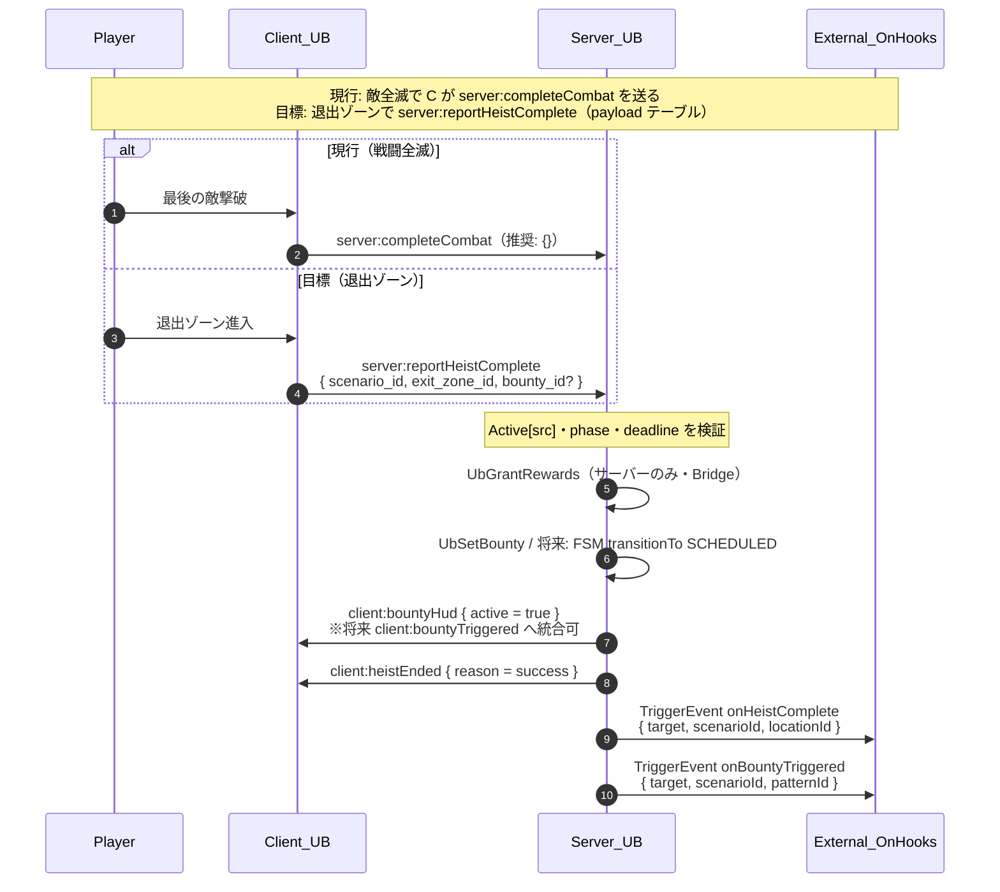
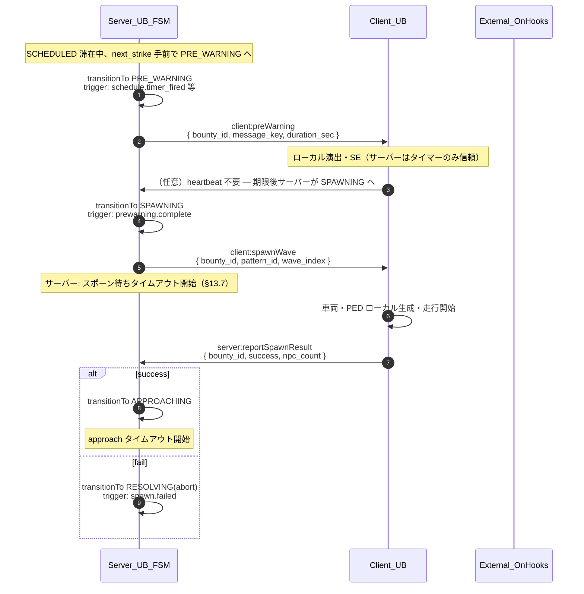
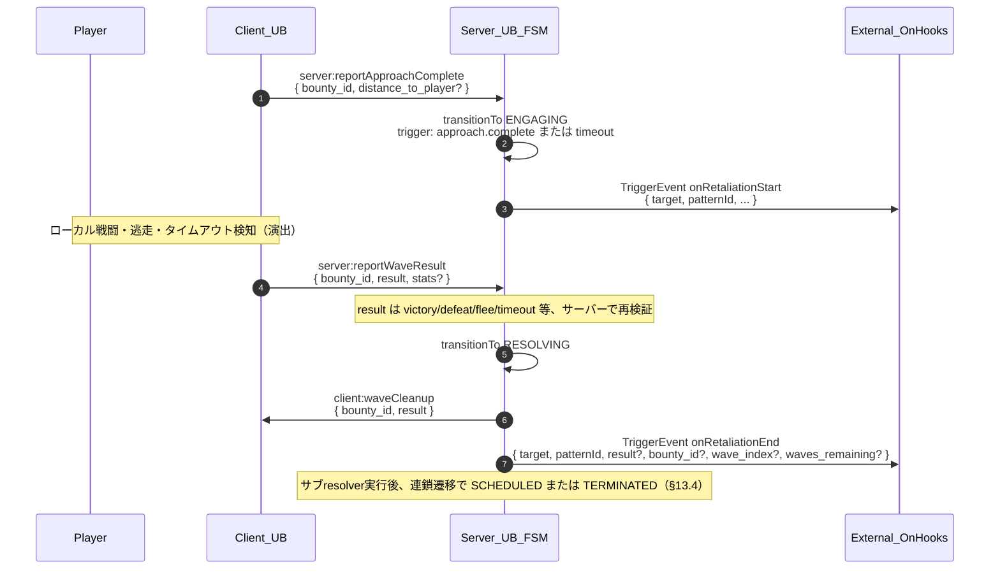
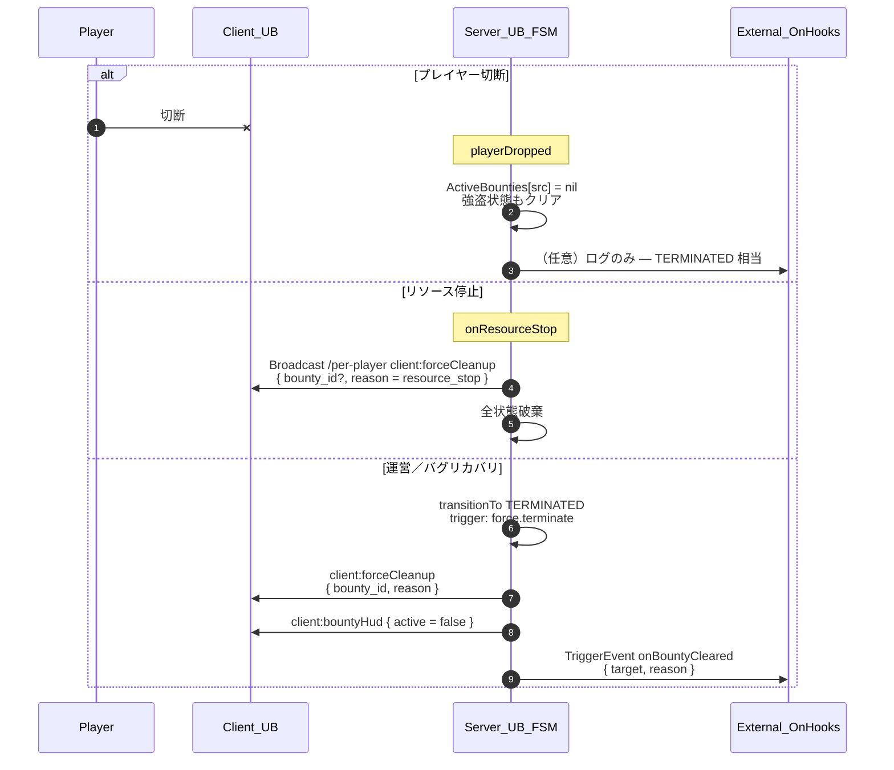

# サーバー↔クライアント シーケンス仕様書

> **ファイル**: `docs/SEQUENCE_DIAGRAMS.md`  
> **対象**: PHASE 3〜4 のサーバー／クライアント実装、および将来のクライアントスタブ作成  
> **関連**: `docs/RETALIATION_FSM.md` §13、`docs/EVENT_HOOKS.md`、`docs/PLAYER_FLOW.md`、`docs/DESIGN.md`  
> **最終更新**: 2026-05-03  
> **バージョン**: v1.0

---

## 1. 本書の目的

本書は、jp-UnderworldBounty におけるサーバー↔クライアント間のメッセージング（FiveM の `TriggerClientEvent` / `TriggerServerEvent`、およびサーバー内の `TriggerEvent` 公開フック）を、**シーケンス図と payload 仕様の両面から定義**する。

`RETALIATION_FSM.md` §13 の擬似コードではサーバー側の状態遷移とフックまで明確化されているが、クライアントが何を受け取り何を返すかは文章ベースに留まっていた。本書はそのギャップを埋め、サーバーとクライアントを**並行実装可能**にすることを目的とする。

具体的には次の 4 系統を Mermaid sequence diagram で示す。

1. 強盗成功から指名手配（FSM の SCHEDULED 相当）確立まで  
2. PRE_WARNING〜APPROACHING の襲撃準備  
3. ENGAGING〜RESOLVING の戦闘・解決  
4. 緊急停止（切断・リソース停止・強制クリーンアップ）

---

## 2. 設計原則

### 2.1 命名規則

| 種類 | 接頭辞 | 例 |
|------|--------|-----|
| サーバー→クライアント | `jp-UnderworldBounty:client:*` | `client:spawnWave` |
| クライアント→サーバー | `jp-UnderworldBounty:server:*` | `server:reportWaveResult` |
| サーバー内・他リソース向け公開フック | `jp-UnderworldBounty:on*` | `onBountyTriggered`（`EVENT_HOOKS.md` 正本） |

grep 時にメッセージ方向が判別しやすいよう、上記 3 種で接頭辞を分ける。

### 2.2 Payload は常にテーブル 1 本（本リソースの UB イベント）

本リソースが送受信する **`jp-UnderworldBounty:*` 系**については、payload を**単一の Lua テーブル**に統一する。

```lua
-- 良い例
TriggerClientEvent(UbEvent('client:spawnWave'), target, { bounty_id = '...', wave_index = 1 })

-- 禁止（複数引数でデータを渡す）
TriggerClientEvent(UbEvent('client:spawnWave'), target, bountyId, waveIndex)
```

**例外**: `bridge/` がフレームワーク既定通知（`esx:showNotification` 等）へ橋渡しする場合は、相手イベントの仕様に従う（本書の対象外）。

理由: フィールド追加で呼び出しを壊しにくい、`pairs()` でログにしやすい、将来 JSON 化しやすい、公開フックと「テーブル 1 本」の方針が一致する。

### 2.3 サーバーは状態の正本、クライアントは演出担当

`RETALIATION_FSM.md` §2.1 に同じ。FSM の決定権はサーバー。クライアントは事実報告のみ。報酬・撃破確定はサーバー側で検証する。

### 2.4 往復メッセージには `bounty_id` を含める（報復フェーズ）

指名手配が存在するフェーズでは、サーバー↔クライアントのやり取りに **`bounty_id`** を含める（§13 のタイマー・スナップショット検証と同様に、過去セッションの stale メッセージを破棄しやすくする）。

**現行実装（v1.0.0）**: `bounty_id` 文字列は未導入でプレイヤー src で 1 件管理。FSM 寄せ時に UUID 等を付与して本項を満たす。

### 2.5 タイムアウトはサーバー側で管理

クライアント返答待ちのタイムアウトは **サーバー側 FSM タイマー**（§13.7）で管理する。クライアントだけが勝手にタイムアウトしてサーバーへ別結果を送る設計は採らない。

---

## 3. メッセージ一覧

### 3.1 サーバー → クライアント（`jp-UnderworldBounty:client:*`）

| イベント名 | 発生タイミング（目標／FSM） | 主要 payload キー | 備考 |
|------------|---------------------------|-------------------|------|
| `client:bountyTriggered` | SCHEDULED 初回入場 | `bounty_id`, `expires_at`, `max_waves`, `scenario_id`, `pattern_id` | §13 フック例。**現行**は `client:bountyHud` `{ active = true }` のみ |
| `client:preWarning` | PRE_WARNING 入場 | `bounty_id`, `message_key`, `duration_sec` | **未実装**（現行は `client:openFlavor` のみ） |
| `client:spawnWave` | SPAWNING 入場 | `bounty_id`, `pattern_id`, `wave_index` | **未実装**（現行は `client:retaliationStart` が近い） |
| `client:waveCleanup` | RESOLVING 入場 | `bounty_id`, `result` | **未実装** |
| `client:forceCleanup` | TERMINATED／強制解除 | `bounty_id`, `reason` | 一部経路で実装（`server/main.lua` 等） |
| `client:bountyHud` | HUD 更新 | `active`, （将来）`bounty_id`, `waves_remaining`, `expires_at` | **実装済み** |
| `client:heistSync` | 強盗フェーズ同期 | `phase`, `scenario_id`, `deadline`, `minigame?` | **実装済み** |
| `client:heistEnded` | 強盗終了 | `reason` | **実装済み** |
| `client:openFlavor` | フレーバー通知 | `string` キー **または** テーブル化を推奨 | **実装済み**（現状は文字列 1 引数。将来はテーブル 1 本へ寄せる） |
| `client:retaliationStart` | 襲撃ウェーブ開始指示 | `pattern_id`, `scenario_id`, （将来）`bounty_id`, `wave_index` | **実装済み** |

公開フック `on*` はクライアントへ飛ばない（`EVENT_HOOKS.md`）。

### 3.2 クライアント → サーバー（`jp-UnderworldBounty:server:*`）

| イベント名 | 発生タイミング | 主要 payload キー | 想定される後続 FSM 遷移 |
|------------|----------------|-------------------|-------------------------|
| `server:reportHeistComplete` | 退出ゾーン到達（将来） | `scenario_id`, `exit_zone_id`, `bounty_id?` | IDLE→SCHEDULED |
| `server:completeCombat` | 敵全滅・戦闘完了（現行） | （現状は引数なし。**推奨**: `{}` に統一） | 強盗成功→報酬→指名付与 |
| `server:reportSpawnResult` | クライアント側スポーン処理完了 | `bounty_id`, `success`, `npc_count` | SPAWNING→APPROACHING or RESOLVING(abort) |
| `server:reportApproachComplete` | 車両が停車／接触判定 | `bounty_id`, `distance_to_player?` | APPROACHING→ENGAGING |
| `server:reportWaveResult` | 戦闘終了判定 | `bounty_id`, `result`, `stats?` | ENGAGING→RESOLVING |
| `server:reportPlayerDeath` | プレイヤー死亡（任意） | `bounty_id`, `killer_type?` | 任意→RESOLVING(defeat) 等 |
| `server:requestStart` | 強盗開始要求 | `location_id`（現行は文字列 1 引数） | 強盗 IDLE→進行 |
| `server:confirmEntry` | 侵入ミニゲーム結果 | `ok`（現行は boolean 1 引数） | entry→combat |
| `server:npcSpawnFailed` | NPC スポーン失敗 | （現状引数なし） | 強盗失敗 |
| `server:cancelHeist` | キャンセル | （現状引数なし） | 強盗中断 |
| `server:playerDownDuringHeist` | 強盗中死亡 | （現状引数なし） | fail／cancel |
| `server:retaliationWaveEnd` | 報復ウェーブ終了（現行） | `survived` boolean（**推奨**: テーブルへ移行） | 実質 ENGAGING 完了の単純版 |

`vehicle_handle` などエンティティハンドルをサーバーに送っても **サーバーでは信用しない**（チート・同期ずれのため）。ログ用なら optional で可。

### 3.3 サーバー内公開イベント（`jp-UnderworldBounty:on*`）

`EVENT_HOOKS.md` が正本。本書では概要のみ。

| イベント名 | 発火タイミング |
|------------|----------------|
| `onHeistStart` | 強盗開始承認時 |
| `onHeistComplete` | 強盗成功処理時（報酬・指名付与の直近） |
| `onHeistFail` | 失敗・キャンセル等 |
| `onBountyTriggered` | 指名手配付与時（SCHEDULED 相当の処理内） |
| `onRetaliationStart` | 襲撃ウェーブ開始指示時 |
| `onRetaliationEnd` | ウェーブ終了時 |
| `onRetaliationAbort` | スポーン失敗等・ウェーブ非消費の中断 |
| `onBountyCleared` | 指名完全解除時 |
| `onPlayerKilled` | 報復中などプレイヤー死亡通知時 |

公開フックの payload は **`EVENT_HOOKS.md` のキー命名（例: `scenarioId`, `patternId`, `target`）に合わせる**。クライアント向けイベントとは別命名でもよいが、ドキュメント間で意味対応を崩さないこと。

---

## 4. シーケンス図 1: 強盗成功〜指名手配確立

`PLAYER_FLOW.md` のシーン #19〜#21 に対応。完了トリガーは **現行** と **目標** で異なる（`PLAYER_FLOW.md`「実装コードベースとの対応」参照）。



**実装上の送信順（現行 `server/heist.lua`）**: `UbGrantRewards` → `UbSetBounty`（内部で `client:bountyHud` と `onBountyTriggered`）→ 通知 → `Active` クリア → `client:heistEnded` → `onHeistComplete`。

---

## 5. シーケンス図 2: PRE_WARNING〜APPROACHING（襲撃準備）

タイマーで SCHEDULED→PRE_WARNING→SPAWNING→APPROACHING と進む **目標** フロー。現行は一部状態がサーバー表には未展開。



---

## 6. シーケンス図 3: APPROACHING〜ENGAGING〜RESOLVING



**現行との対応**: `server:retaliationWaveEnd(survived)` が `reportWaveResult` の単純化版（boolean のみ）。テーブル化・`result` 列挙へ寄せると本図と一致する。

---

## 7. シーケンス図 4: 緊急停止・クリーンアップ



---

## 8. `bounty_id` 検証パターン（推奨）

サーバー側ハンドラの先頭で次を行う（§13 と同じ精神）。

```lua
-- 擬似コード
local function validateBountyMessage(src, bounty_id)
  local st = ActiveBounties[src]
  if not st or st.bounty_id ~= bounty_id then
    return nil
  end
  return st
end
```

現行は `BountyBySrc[src]` のみで `bounty_id` 未保持のため、FSM 実装時にフィールド追加する。

---

## 9. 実装との対応（v1.0.0 時点）

| 本書の目標イベント | 現行コードの近似 |
|-------------------|------------------|
| `server:reportHeistComplete` | 未実装（`server:completeCombat` が完了トリガー） |
| `client:bountyTriggered` | `client:bountyHud` |
| `client:preWarning` | `client:openFlavor('notify_retaliation_hint')` のみ |
| `client:spawnWave` | `client:retaliationStart` が兼務 |
| `server:reportSpawnResult` | 未実装（クライアントが単に開始後タイマーで報告しない） |
| `server:reportApproachComplete` | 未実装（接近はクライアント自律） |
| `server:reportWaveResult` | `server:retaliationWaveEnd(boolean)` |
| `client:waveCleanup` | 未実装 |

---

## 10. 改訂履歴

| 日付 | バージョン | 変更内容 |
|------|------------|----------|
| 2026-05-03 | v1.0 | 初版。メッセージ一覧・4 系統の Mermaid・現行実装差分表 |
