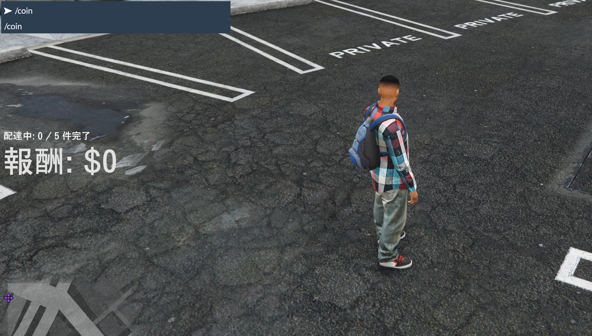
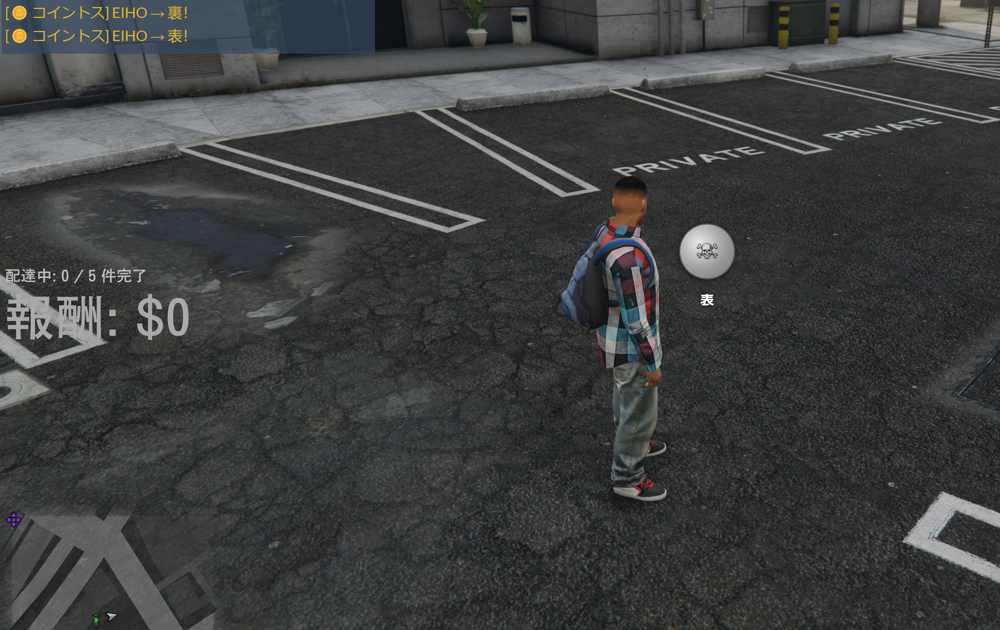
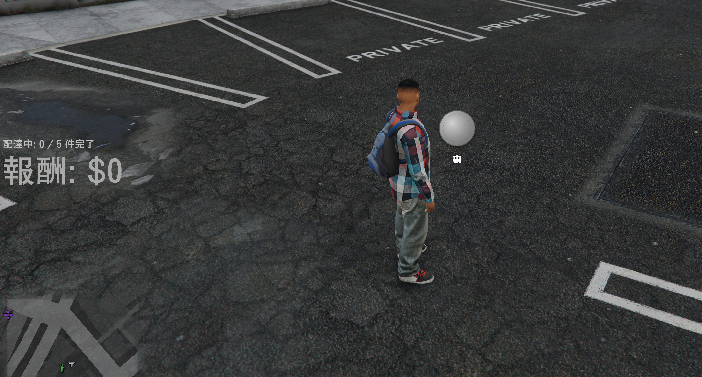

# jp-coin

`/coin` でコイントスを行う、スタンドアロンの FiveM リソースです。  
3D 回転演出で表裏を表示し、周囲プレイヤーに結果をチャット共有できます。

## 特徴

- 物理っぽいコイントスを再現した 3D アニメーション
- ドクロデザインのコイン（表）と無地の裏面
- 周囲プレイヤーへのローカル範囲チャット通知
- フレームワーク依存なし（standalone）

## インストール

1. `resources/[jp-mods]/jp-coin/` に配置
2. `server.cfg` に以下を追加

```cfg
ensure jp-coin
```

## 設定（config.lua）

- `Config.Command`  
  コマンド名（デフォルト: `coin`）。
- `Config.DisplayTime`  
  結果表示時間（ミリ秒）。回転アニメーション完了後に適用されます。
- `Config.AnimationTime`  
  コイン回転アニメーション時間（ミリ秒）。
- `Config.Cooldown`  
  連打防止クールダウン（秒）。
- `Config.ChatRange`  
  結果通知の範囲（メートル）。
- `Config.ShowChatMessage`  
  `true` で周囲プレイヤーにチャット通知。
- `Config.HeadsLabel` / `Config.TailsLabel`  
  表裏の表示名。好みの表現に変更できます。

## 使い方

チャットで `/coin` と入力するだけです。

## スクリーンショット

### 1. `/coin` の入力画面



### 2. 表（ドクロ）



### 3. 裏（なし）



## 活用例

- 勝負事の決着
- 順番決め
- 賭け事 RP

## ライセンス

MIT
