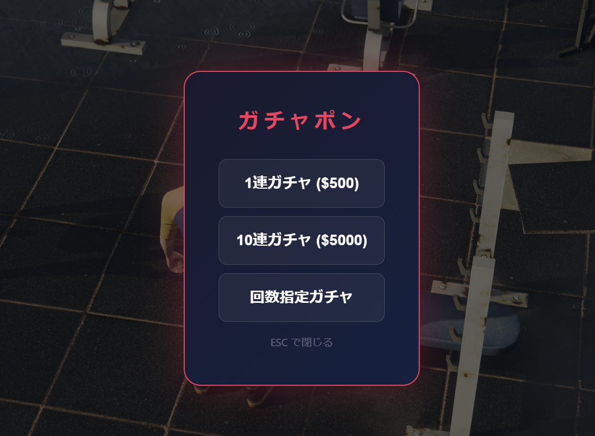
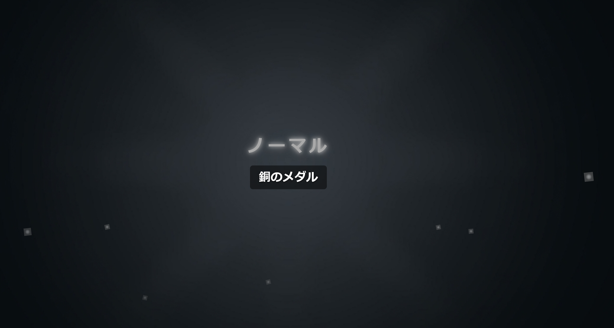
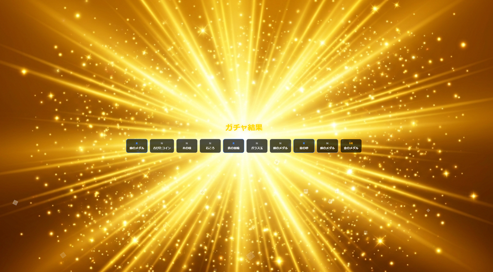
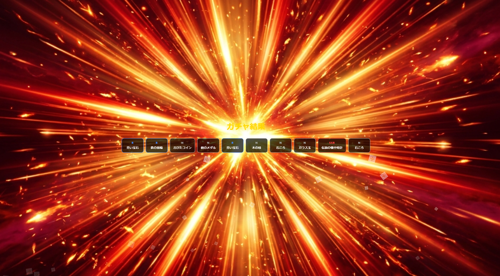
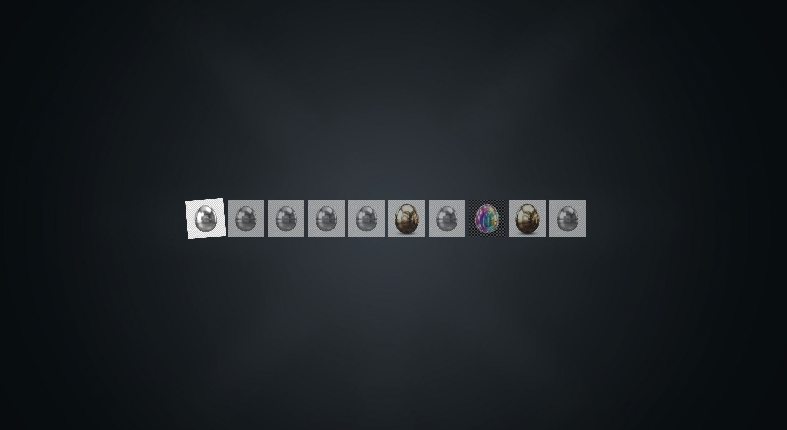
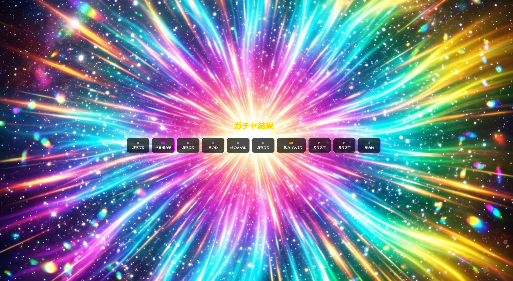

# jp-gacha

FiveM 用ガチャポン。マシン付近で **E** キーを押すとフルスクリーン NUI で
カプセル落下 → ヒビ → 割れ → 背景変化 → カットイン（SR 以上）→ 結果表示の流れが再生されます。

## 特徴

- フルスクリーン NUI 演出（N / R / SR / SSR / UR）
- SR 以上はカットイン、SSR/UR は画面揺れ＋星パーティクル
- フレームワーク自動検出（ESX / QBCore）＋ スタンドアロン
- 排出物・重み・座標・演出時間は `config.lua` で調整

## インストール

1. 本フォルダを `resources/[jp-mods]/jp-gacha/` に置く
2. `server.cfg` に `ensure jp-gacha` を追加
3. `config.lua` で `Config.Machines`・`Config.Cost`・`Config.ItemsByRarity` 等を編集
4. 任意: `html/sounds/` に下表の MP3 を入れる（無くても動作する）

## 効果音（任意）

| ファイル名 | 用途 |
|------------|------|
| gacha_roll.mp3 | カプセル落下 |
| crack.mp3 | ヒビ |
| break_open.mp3 | 割れ |
| cutin.mp3 | カットイン |
| result_normal.mp3 | N/R 結果 |
| result_rare.mp3 | SR 以上 結果 |

NUI では再生前に存在確認（`fetch` HEAD 等）を行い、ファイルが無い場合にコンソールエラーを出さないようにしてあります。

## 主な設定（config.lua）

- `Config.Machines` – マシン座標・向き
- `Config.Cost` / `Config.Cooldown` – 1 回の料金（現金）とクールダウン
- `Config.Rarities` – 確率と演出定義
- `Config.ItemsByRarity` – レアリティごとの排出候補（運営者はここを編集）
- `Config.Timing` – 演出タイムライン（ms）
- `Config.Blip` – 地図アイコン
- `Config.Debug` – デバッグ出力

### アイテム設定場所（運営向け）

`config.lua` の `Config.ItemsByRarity` が、出現アイテム一覧です。

- `N` / `R` / `SR` / `SSR` / `UR` の各配列に景品を追加
- 各要素は `{ name = "表示名", image = "" }`
- `image` は将来の画像URLやNUI用パスを入れる想定（空でOK）

## 使い方

1. マップのガチャアイコンへ向かう  
2. マシンに近づく（プロップ＋NUI 用 `machine.png`）  
3. E でガチャ  
4. SR 以上は全体チャット、N/R は本人チャット

## 説明画像（README用）

画像は `jp-gacha/docs/screenshots/` に配置してください。  
下記ファイル名で置くと、そのまま README に貼れます。

- `menu-selection.png`（ガチャのメニュー選択画面）
- `single-normal.png`（単発 / ノーマル）
- `multi10-sr.png`（10連 / SR当選）
- `multi10-ssr.png`（10連 / SSR当選）
- `multi10-ur-before.png`（10連 / UR当選 / 開封前）
- `multi10-ur-cutin.png`（10連 / UR当選 / URカットイン）
- `multi10-ur-result.png`（10連 / UR当選 / 開封結果）

### スクリーンショット

#### メニュー

#### 単発

#### 10連（SR/SSR/UR）

## ライセンス

MIT
