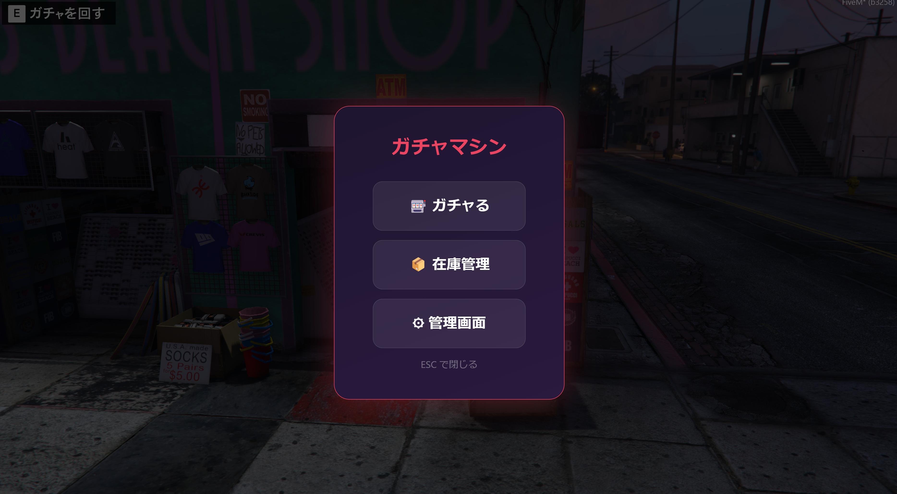
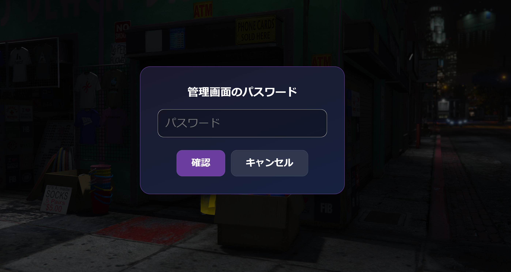
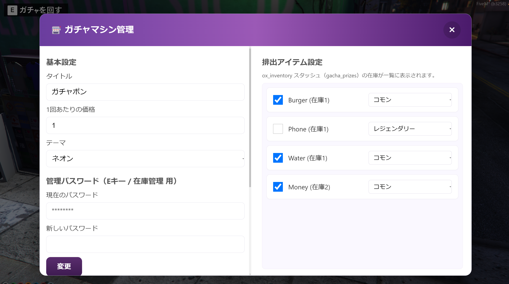
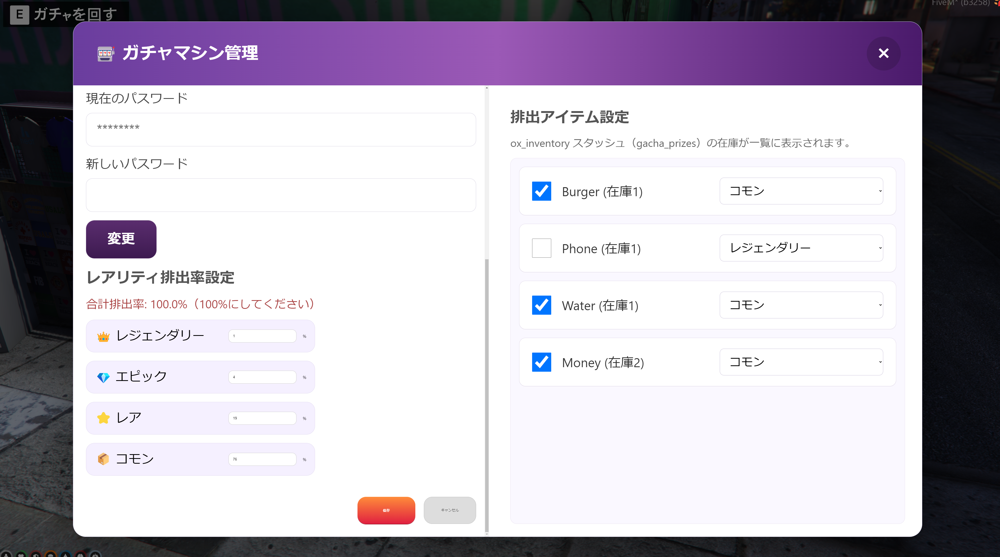
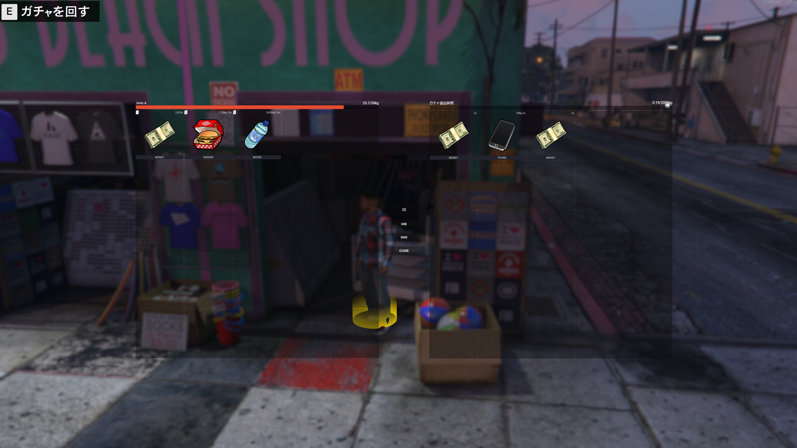
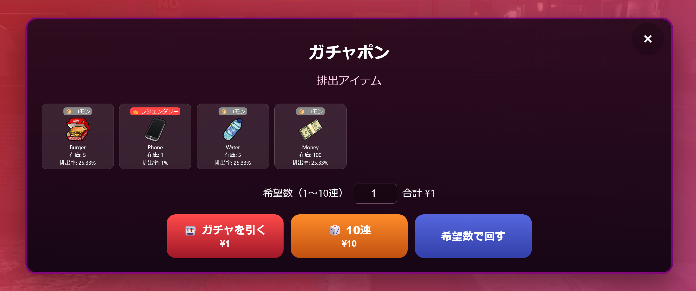
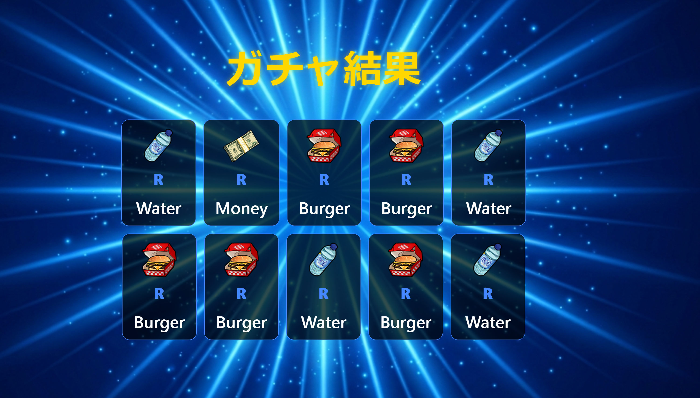

# jp-gacha2

FiveM 用**ガチャマシン（v2）**。マシン付近で **E** キーでトップメニューが開き、**カプセル演出**（落下 → ヒビ → 割れ → 背景 → カットイン → 結果）が NUI 再生されます。  
**ox_inventory** のスタッシュを景品在庫として使い、**KVS 保存の管理画面**で排出率・景品ON/OFF・タイトル等を変更できます（フレームワーク非依存のスタンドアロン想定）。

リポジトリ: [fivem-mods_ja / jp-gacha2](https://github.com/matrix9neonebuchadnezzar2199-sketch/fivem-mods_ja/tree/main/jp-gacha2)

## 特徴

- トップ: 「ガチャる」「在庫管理（スタッシュ）」「管理画面（パス）」
- 景品は原則 **ox スタッシュ**（既定 `gacha_prizes`）＋在庫から抽選。結果は**商品画像**表示（`https://cfx-nui-ox_inventory/web/images/<item>.png` 等）
- 管理 UI: 左右分割（基本・レア率・**排出アイテム一覧**）。`/gachaadmin`（ACE）で緊急メニュー可
- 演出: N / R / SR / SSR / UR、SR 以上カットイン、SSR/UR 揺れ＋パーティクル
- 課金: `Config.Framework` の `auto` で ESX / QBCore(Qbx) / ox 現金 等を優先。現金（銀行は使わない扱いが基本）

## インストール

1. 本フォルダを `resources/[jp-mods]/jp-gacha2/` などに置く（フォルダ名＝起動名）
2. `server.cfg` に `ensure jp-gacha2` を追加
3. **ox_inventory** を導入済み想定。`config.lua` の `Config.StashName` 等でスタッシュ名を合わせる
4. `config.lua` で `Config.Machines`・`Config.Cost`・`Config.AdminPassword` 等を編集
5. 任意: `html/sounds/` に下表の MP3（無くても動作）

## 効果音（任意）

| ファイル名        | 用途        |
|-------------------|-------------|
| gacha_roll.mp3    | カプセル落下 |
| crack.mp3         | ヒビ        |
| break_open.mp3    | 割れ        |
| cutin.mp3         | カットイン  |
| result_normal.mp3 | N/R 結果    |
| result_rare.mp3   | SR 以上結果 |

## 主な設定（`config.lua` 抜粋）

- `Config.Machines` – マシン座標・向き
- `Config.Cost` / 管理画面の価格（KVS）/ `Config.Cooldown`
- `Config.UIScale` – NUI 拡大率（例: `4.0`）
- `Config.StashName` / `StashLabel` / `StashSlots` / `StashMaxWeight` – 景品スタッシュ
- `Config.FallbackToConfigIfStashEmpty` – スタッシュ空のとき `Config` 枠に戻すか
- `Config.CatalogStashOnly` – 景品一覧をスタッシュ在庫のみにする
- `Config.RarityDisplayNames` – 4段階（レジェ〜コモン）管理 UI 用
- `Config.Timing` – 演出 ms
- `Config.Blip` – 地図アイコン
- `Config.Debug` – デバッグ

## 使い方

1. 地図の Blip へ向かい、マシンに近づく  
2. **E** → トップメニュー → **ガチャる** または 管理/在庫（パス認証）  
3. 排出はサーバーで抽選。在庫が無い枠は排出されない設定が基本  

## 説明画像（GitHub 用・推奨パス）

画像は `docs/readme-images/` に置きます。ファイル名の目安は同フォルダの `画像ファイル名の目安.txt` を参照。

| シーン | 推奨ファイル名 |
|--------|----------------|
| メニュー | `menu.png` |
| 管理者パスワード画面 | `admin-password.png` |
| 管理画面（例: 左カラム） | `admin-1.png` |
| 管理画面（例: 右カラム） | `admin-2.png` |
| 在庫管理（ox スタッシュ） | `inventory-stash.png` |
| ガチャ画面（景品一覧・回数） | `gacha-screen.png` |
| ガチャ結果 | `gacha-result.png` |

### スクリーンショット（`docs/readme-images`）

### 補足: 旧スクリーンショット用フォルダ（10連 等）

`docs/screenshots/` に 10 連系のファイル用プレースホルダ用パスがあります（必要に応じて同様に `` を追加）。

- `docs/screenshots/menu-selection.png`
- `docs/screenshots/single-normal.png`
- `docs/screenshots/multi10-*.png` 等

## デモ動画

- [docs/video1.mp4](docs/video1.mp4)

## ライセンス

MIT
