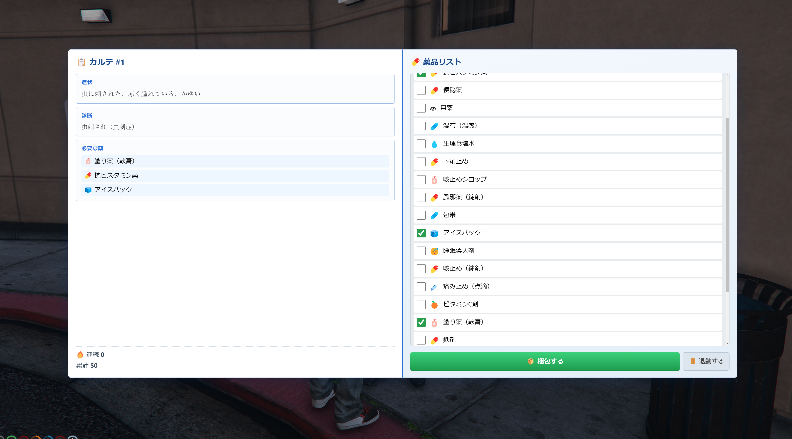
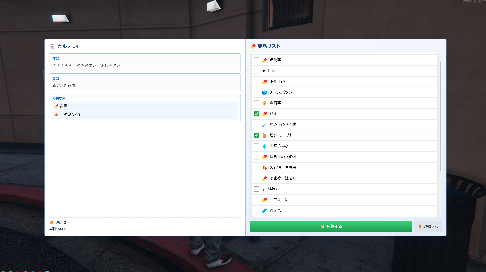
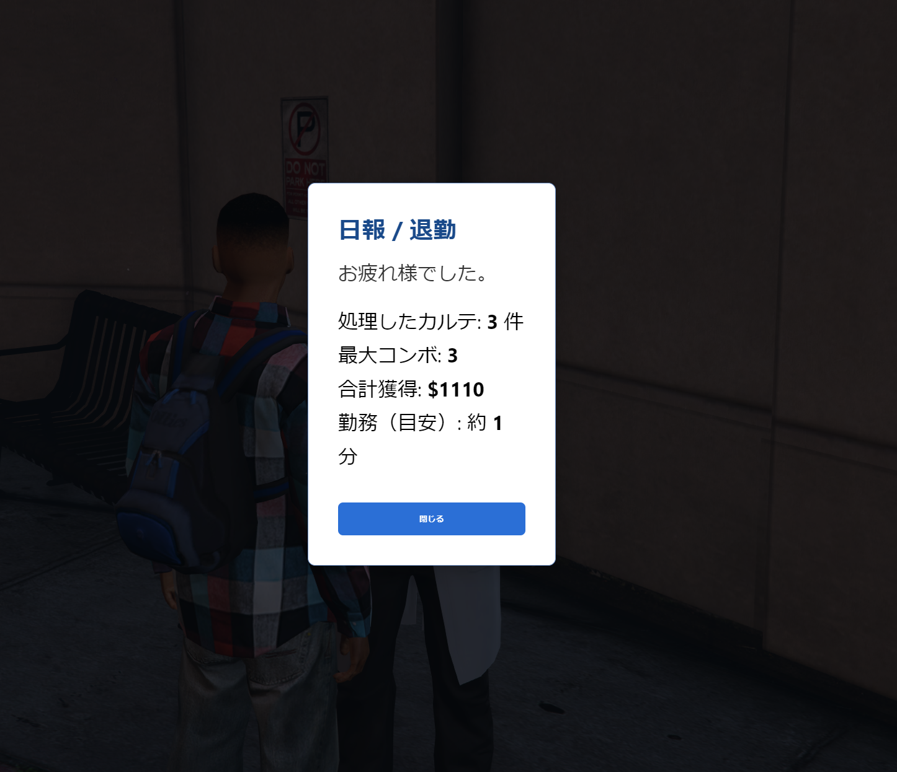

# jp-hospital

**病院カルテ整理・薬梱包**のミニゲーム（NUI 内職）です。症状に合わせて**正しい薬を梱包**し、**サーバ側**で正解を二重検証したうえで報酬（現金）を付与します。Qbox 系（`qbx_core`）想定。

## スクリーンショット

| 内容 |  |
| --- | --- |
| カルテ1 |  |
| カルテ2 |  |
| リザルト画面 |  |

## 遊び方（プレイヤー）

1. **就業用 NPC**（`config.lua` の `Config.JobPedCoords`）に近づき、`ox_target` 等でメニューから**難易度**（初級／中級／上級）を選ぶ。出題数・正解数・ダミー数・基礎報酬（`Config.Difficulties`）が変わる。
2. 画面左に**症状・診断**、右に**梱包する薬の候補**（ダミー混じり）が出る。**正解の薬だけ**を梱包エリアにドラッグする。
3. カルテを**確定**すると、連続正解（コンボ）に応じた**倍率**がかかった報酬が支払われる。退勤は `config.lua` の **`Config.ExitCommand`**（既定 `hospital`）等で NUI を閉じる。

## 導入（サーバ運営者）

| 前提 | 備考 |
| --- | --- |
| `qbx_core` | 職・現金付与 |
| `ox_lib` | 通知等 |
| `ox_target` | 就業 NPC 操作 |

1. `jp-hospital` を `resources` に置く。  
2. `server.cfg` 例: `ensure jp-hospital`（依存リソースを先に起動）。  
3. **主に触るのは** `config.lua`（NPC 座標・`Config.Difficulties`・`Config.Medicines` など）と、**出題そのもの**は `data/kartes_easy.lua` / `data/kartes_medium.lua` / `data/kartes_hard.lua`（難易度ごとに `Config.Kartes` / `KartesMedium` / `KartesHard`）。**`refresh` 後「出題庫が空」**のときは、上記 3 ファイル＋`config.lua` のデプロイ漏れがないか確認（`jp-mechanic` と同じく `shared_script` 順で読み込み）。

## 仕様（簡易）

- **正解の生成**はサーバ、クライアント表示と**サーバ検証**の二重化で、チート向けの単純な偽装を想定。  
- 薬の種類は `config.lua` の `Config.Medicines`、**カルテ出題**は `data/kartes_*.lua` で拡張可能（`answers` の id は `Medicines` と一致させる）。

## クレジット

- 紹介画像: `docs/images/01-karte-1.png` ほか 3 枚。

## バージョン

- `fxmanifest.lua` の `version` 参照
