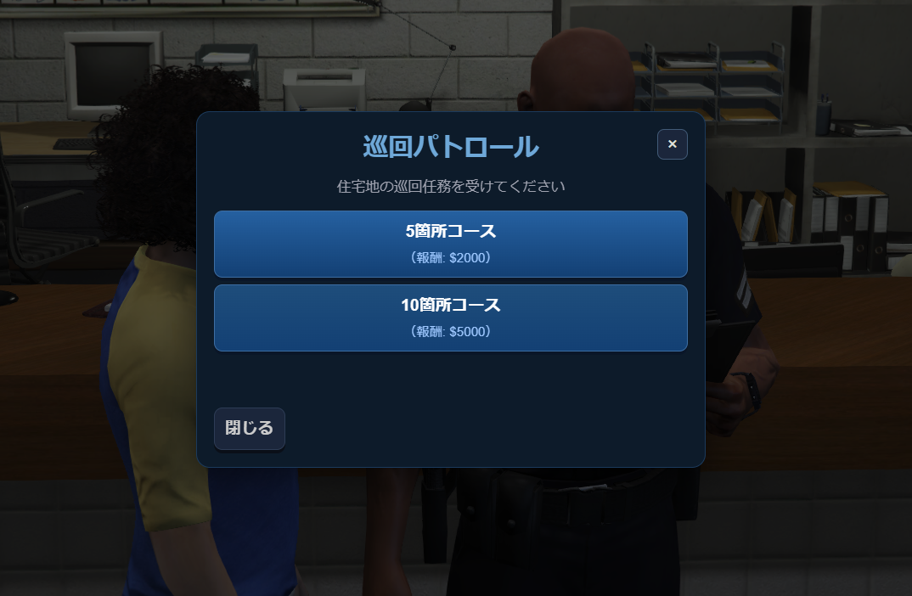
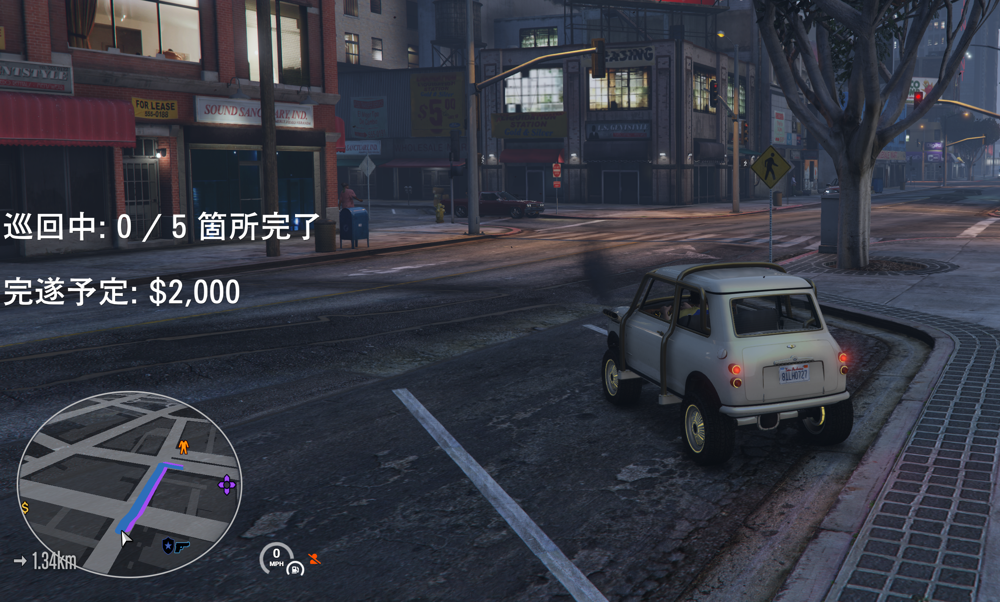
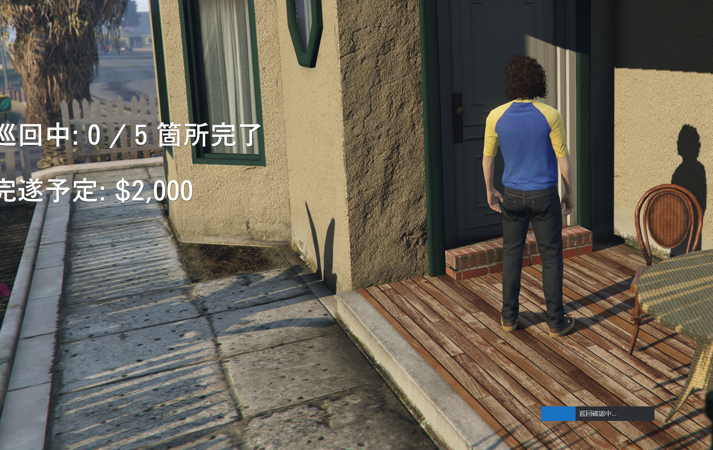
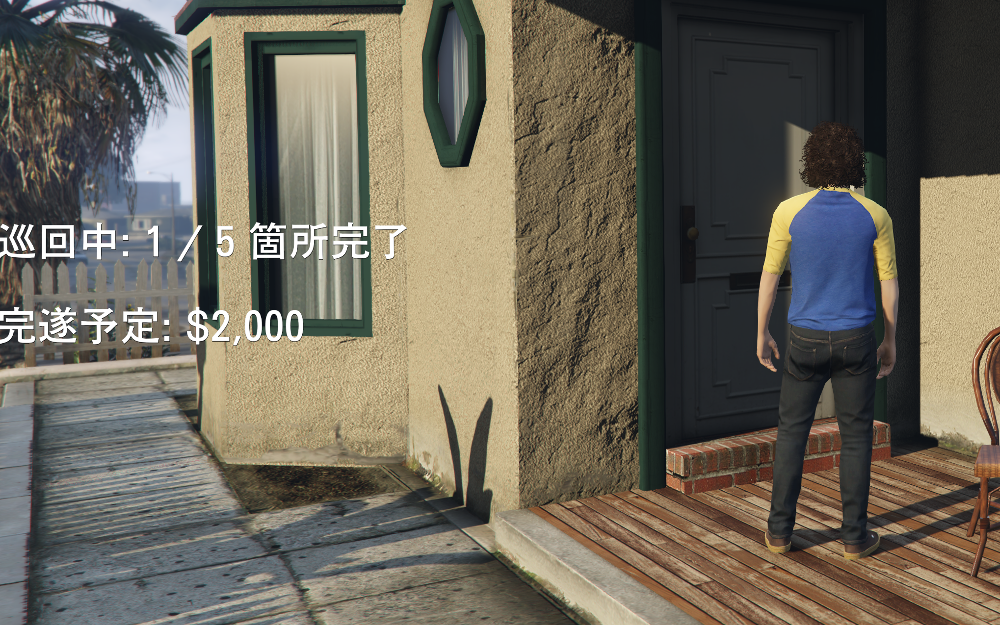

# jp-koban

**警察向けの住宅地巡回パトロール**リソースです。Qbox 系（`qbx_core`）を想定し、**DB なし**で完遂時に現金ボーナスを一括付与します。

## スクリーンショット

| 内容 |  |
| --- | --- |
| 受注（5 箇所 / 10 箇所コース） |  |
| 次の地点まで道なりナビ |  |
| 住宅地周辺の巡回 |  |
| 1 箇所の巡回確認が完了したところ |  |

## 遊び方（プレイヤー）

1. **受付用 NPC**（`config.lua` の座標）の警察官に近づき、**E** または `ox_target` でメニュー。
2. コースを選ぶと、**ランダムな地点**に順番にナビ（ウェイポイント＋ルート）が付く。
3. 各地点の近くで**徒歩**、**E**（巡回確認）— 全箇所を踏んだら受付に戻り、**巡回報告**で報酬受取。

画面左のテキストで、**何箇所目／何箇所中**と**完遂時の想定額**が出ます。巡回中の連打や車内確認は想定外なので、案内に従ってください。

## 導入（サーバ運営者）

| 前提 | 備考 |
| --- | --- |
| `qbx_core` | ジョブ参照に使用 |
| `ox_lib` | 通知・プログレス等 |
| `ox_target` | 受付 NPC（併用） |
| 現金付与 | サーバ側の設計（本 MOD の `server/main.lua` 参照）に合わせて利用してください |

1. リポジトリから `jp-koban` を `resources` に置く。  
2. `server.cfg` 例: `ensure jp-koban`（依存先が先に起動するように）  
3. `config.lua` の**座標・報酬・必須ジョブ**を、自サーバの地図・給与に合わせる。

`config.lua` には**日本語コメント**で各項目を説明しています。主なのは次の通りです。

- **`Config.RequiredJob`**: 受注・報告を許可する職名（Qbox の `job.name`）。例: `police`
- **`Config.CompletionBonus5` / `CompletionBonus10`**: 5 箇所・10 箇所コース**完遂**時の一括ボーナス
- **`Config.PatrolLocations`**: 候補から**ランダムに**抜き、所要数まで巡回させます。点数が足りないと受注失敗扱いになります。
- **`Config.JobPedCoords` / `JobPedZOffset`**: 受付 NPCの位置。署内 MLO では**足が沈む／浮く**なら `JobPedZOffset` だけ小さく調整してください。

## 仕様（簡易）

- **受注・完遂**は、クライアント表示と**サーバのジョブ検証**の双方で、設定した職名と一致する場合に限り有効化されます（不正向けの二重チェック）。
- **他フレームワーク依存はありません**（Qbox 前提の箇所は `qbx_core` の `GetPlayerData` 等。移植時は同ファイルを置き換え）。
- 途中キャンセルは `config.lua` の **`Config.CancelCommand`** から（既定 `patrol`）。

## クレジット

- プロジェクト: [AGENTS.md](../AGENTS.md) の方針に従う **jp-mods** 風味のスタンドアロン実装。  
- 紹介画像: 上記 4 枚。パスは `docs/images/01-order.png` 等。

## バージョン

- `fxmanifest.lua` の `version` 参照
