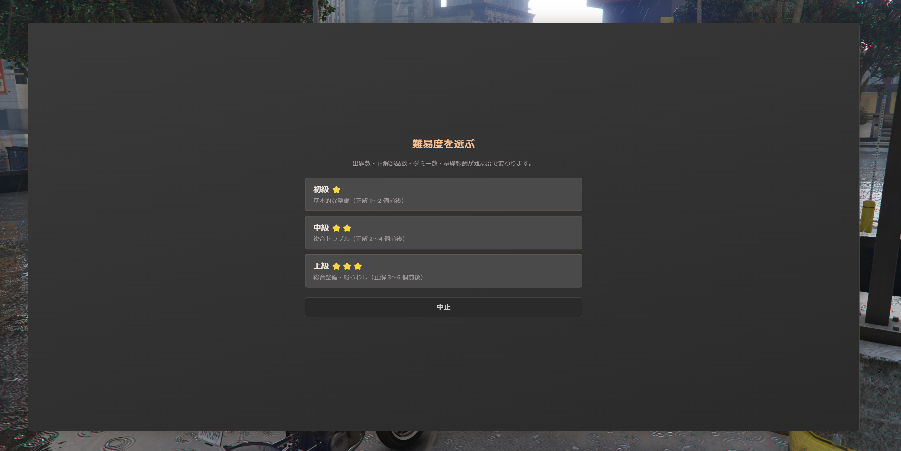
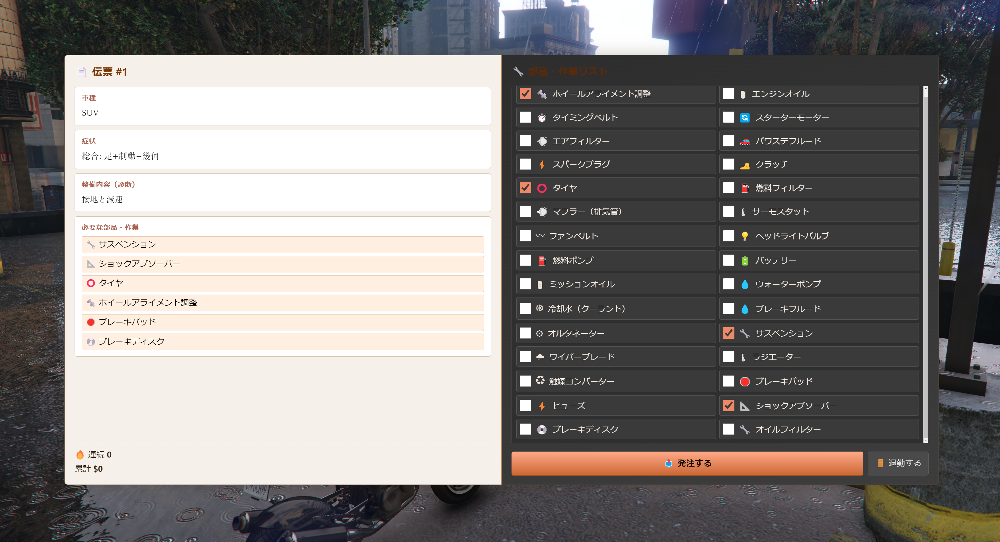
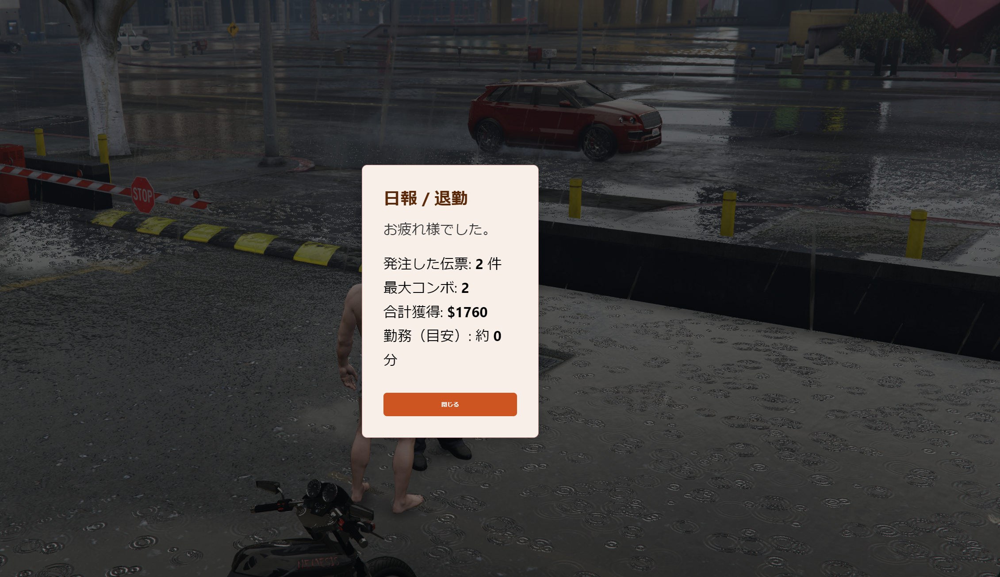

# jp-mechanic

整備工場前の NPC から、伝票（**症状・車種・整備内容**）に合う**部品・作業**を右のリストから選び、**発注**する内職 NUI です。流れは同リポ内の [jp-hospital](../jp-hospital/README.md)（カルテ整理）と同型で、難易度別に `data/slips_*.lua` の出題数・ダミー部品数・基礎報酬が変わります。

## 目次

- [スクリーンショット](#スクリーンショット)
- [特徴](#特徴)
- [必要環境](#必要環境)
- [導入](#導入)
- [主な設定（`config.lua`）](#主な設定configlua)
- [操作の流れ](#操作の流れ)
- [出題庫の編集](#出題庫の編集)
- [トラブル時の確認](#トラブル時の確認)
- [ファイル構成](#ファイル構成)

---

## スクリーンショット

> 画像は `docs/images/` に配置します。ファイル名は [docs/images/README.md](docs/images/README.md) を参照。

| 受注 | 伝票整理中 | リザルト |
|:----:|:----------:|:--------:|
|  |  |  |
| 難易度選択・受付 | 左: 伝票 / 右: 部品チェック | 日報・退勤 など |

画像をまだ置いていない場合は、上の枠内が壊れて見えます。3 枚の PNG を上記パスに追加すると表示されます。

---

## 特徴

- **スタンドアロン**想定（各 `jp-*` は独立リソース）
- **E キー** または **ox_target** で内職開始（`config.lua` で E キー ON/OFF）
- 難易度 **中止** あり（勤務開始前に閉じると日報なし）
- 正解はサーバーで多集合照合（セッション ID 付き）
- 退勤で**日報**（処理件数・最大コンボ・合計獲得・勤務目安分）

---

## 必要環境

- **FiveM** サーバ（`fx_version` / `lua54` は `fxmanifest.lua` 参照）
- **qbx_core** — 現金加算 `AddMoney` 用
- **ox_target** — NPC 選択用（E キーのみにしたい場合は併用で可）
- **ox_lib** — マニフェスト上の依存（他リソースで既に入っている想定）

---

## 導入

1. 本フォルダを `resources` 配下に配置（例: `resources/[jp-mods]/jp-mechanic`）
2. `server.cfg` に `ensure jp-mechanic` または `start jp-mechanic` を追記
3. サーバーコンソールで `refresh` → `restart jp-mechanic`
4. `config.lua` の **NPC 座標**を自サーバーの整備工場前に合わせる
5. クライアント接続し、該当地点で **E** または **ox_target** から「伝票整理（内職）」を選択

---

## 主な設定（`config.lua`）

| 項目 | 説明 |
|------|------|
| `Config.JobPedCoords` | NPC の `vector4(x, y, z, heading)` |
| `Config.UseEKey` | `true` なら近接で E（Enter）でも開始 |
| `Config.ExitCommand` | デフォルト `mechjob` — 退勤用コマンド |
| `Config.Parts` | 部品マスタ（`id` は出題 `answers` と完全に一致させる） |
| `Config.Difficulties` | 難易度ごとに `kartesKey`（`Slips` / `SlipsMedium` / `SlipsHard`）と報酬・ダミー数 |

---

## 操作の流れ

1. NPC へ近づき **E** または **ターゲット** → NUI 表示
2. **難易度**を選ぶ（**中止**で閉じる＝未勤務扱い）
3. 左の伝票（車種・症状・診断）と **必要な部品・作業**を確認
4. 右の **部品・作業リスト**（2 列）で正しい組み合わせにチェック → **発注**
5. 正解で次の伝票へ。退勤は **退勤する** またはコマンド → **日報**

---

## 出題庫の編集

- 初級 / 中級 / 上級はそれぞれ `data/slips_easy.lua` / `slips_medium.lua` / `slips_hard.lua`（**`fxmanifest` では `server_script` 読み込み**・サーバー上の `data/` に必ず配布）
- 各レコードは `symptom`, `vehicle`, `diagnosis`, `answers`（部品 `id` の配列）
- 再生成・一括生成には `tools/gen_slips.py`（`python tools/gen_slips.py`）を利用可能

---

## トラブル時の確認

| 症状 | 確認 |
|------|------|
| 難易度を選んでも始まらない | `qbx_core` が起動しているか、F8 クライアントログ |
| 出題が空 | `data/slips_*.lua` がサーバー側リソースに含まれているか（デプロイ漏れ） |
| 報酬が入らない | `Config.MoneyReason`、QBX の `AddMoney` エラー（サーバーログ） |
| 画像が README に出ない | `docs/images/` に `order.png` 等の**ファイル名**で保存したか |

---

## ファイル構成

```
jp-mechanic/
├── fxmanifest.lua
├── config.lua
├── data/
│   ├── slips_easy.lua
│   ├── slips_medium.lua
│   └── slips_hard.lua
├── client/main.lua
├── server/main.lua
├── html/           # NUI
├── docs/
│   └── images/     # README 用スクリーンショット（上表のファイル名）
└── tools/
    └── gen_slips.py
```

---

作成: JP-Mods 系リソース。利用条件はリポジトリの [LICENSE](../LICENSE) に従います。
