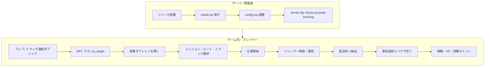

# jp-peak-trucking

[](LICENSE)
[](https://docs.fivem.net/)
[](version.json)
[](shared/locales.lua)
[](https://github.com/Peak-Studios/peak-trucking)
[](shared/config.lua)
[](https://github.com/overextended/oxmysql)

[Peak Trucking](https://github.com/Peak-Studios/peak-trucking) の **完全日本語版** フォークです。  
トラック運転ジョブに、**成長（XP/レベル）・企業信頼・デイリーミッション・ランキング・合法/闇貨物** と **React 製配車タブレット（NUI）** をひとつにまとめた、日本語 FiveM サーバー向けリソースです。

| 対象 | この README の読み方 |
|------|----------------------|
| **サーバー管理者** | [導入フロー](#導入フローサーバー管理者) → [設定](#設定の要点) |
| **プレイヤー** | [ゲーム内の遊び方](#ゲーム内の遊び方プレイヤー) |
| **開発者** | [ディレクトリ構成](#ディレクトリ構成) → [UI の再ビルド](#ui-の再ビルド) |

---

## 目次

- [できること](#できること)
- [全体の流れ](#全体の流れ)
- [導入フロー（サーバー管理者）](#導入フローサーバー管理者)
- [ゲーム内の遊び方（プレイヤー）](#ゲーム内の遊び方プレイヤー)
- [配車タブレットの使い方](#配車タブレットの使い方)
- [闇貨物（オプション）](#闇貨物オプション)
- [コマンド一覧](#コマンド一覧)
- [設定の要点](#設定の要点)
- [依存関係](#依存関係)
- [ディレクトリ構成](#ディレクトリ構成)
- [UI の再ビルド](#ui-の再ビルド)
- [クレジット・ライセンス](#クレジットライセンス)
- [GitHub リポジトリ用タグ](#github-リポジトリ用タグ)

---

## できること

| カテゴリ | 内容 |
|----------|------|
| **ジョブ本体** | 16 種類の貨物ミッション、複数ルート、トレーラー連結・配送・返却 |
| **成長** | ドライバー XP / レベル、完了数・累計収入、直近の仕事履歴 |
| **企業** | 8 社との信頼ポイント。ポイントでミッション解放 |
| **デイリー** | 日次リセット付きデイリーミッション（XP 報酬） |
| **ランキング** | SQL 永続化されたドライバーランキング |
| **闇貨物** | 合法ジョブ中のみ受注可能なサイド（電話 UI + 追加報酬） |
| **HUD** | 輸送中の燃料・トレーラー状態など。`/truckhud` で位置調整 |
| **連携** | QBCore / ESX、ox_target / qb-target、各種インベントリ・燃料 |

---

## 全体の流れ

サーバー導入からプレイヤーが 1 件配送を終えるまでの関係です。



---

## 導入フロー（サーバー管理者）

### 1. 入手・配置

```text
resources/
  [jp-mods]/
    jp-peak-trucking/    ← このフォルダ一式
```

- 本リポジトリ（[fivem-mods_ja](https://github.com/matrix9neonebuchadnezzar2199-sketch/fivem-mods_ja)）の `jp-peak-trucking` をそのまま配置するか、サブフォルダのみコピーしてください。
- **`ui/node_modules` はサーバーに不要**です。配布・運用に必要なのは **`ui/dist`** まで含んだ状態です。

### 2. データベース

`install/install.sql` を MySQL / MariaDB に実行します。

```sql
-- テーブル: peak_trucking
-- プレイヤーごとに level, xp, 信頼ポイント, 解放ミッション, デイリー, 履歴 などを保存
```

初回ログイン時にプレイヤー行が作成されます。

### 3. 設定ファイル

| 順番 | ファイル | やること |
|------|----------|----------|
| ① | `shared/config.lua` | フレームワーク、燃料、キー、ジョブ制限、NPC/ミッション座標 |
| ② | `server/server-config.lua` | Discord 等（任意・トークンは公開しない） |
| ③ | `shared/locales.lua` | 通常は触らない（既定で日本語 `ja`） |

**AI で一括設定したい場合**  
ルートの `PROMPT.md` を Cursor 等に渡すと、環境に合わせた `config.lua` 調整を案内できます（英語プロンプト）。

**よく触る項目（`shared/config.lua`）**

| 項目 | 説明 |
|------|------|
| `Config.Framework` | `'auto'` 推奨（QBCore / ESX を自動検出） |
| `Config.JobName` | `'all'` なら全員、`'trucker'` などでジョブ限定 |
| `Config.NpcLocation` | 受注 NPC の座標・ブリップ名 |
| `Config.VehSpawn` | トラック出庫位置 |
| `Config.Missions` | ミッション・ルート・報酬・必要レベル |
| `Config.Fuel` | `ox_fuel` / `LegacyFuel` 等 |
| `Config.InteractionHandler` | `drawtext` / `ox_target` / `qb_target` 等 |

### 4. server.cfg

**依存を先に**、その後に本リソースを `ensure` します。

```cfg
ensure oxmysql
# フレームワーク例（環境に合わせて）
# ensure qb-core
# ensure es_extended
# ensure ox_target
# ensure ox_inventory

ensure jp-peak-trucking
```

`fivem-mods_ja` 利用時は `scripts/jp-mods-ensure.cfg` の行を `server.cfg` に貼り付けても構いません。

### 5. 起動確認

1. サーバー再起動、または `refresh` → `ensure jp-peak-trucking`
2. F8 コンソールに Lua エラーがないか確認
3. ゲーム内で **「トラック運転手」** ブリップ（デフォルト: ドック付近）が出るか確認
4. NPC でインタラクトし、配車タブレットが開くか確認

---

## ゲーム内の遊び方（プレイヤー）

### どこに行くか

| 場所 | マップ表示 | 座標の目安（デフォルト） |
|------|------------|-------------------------|
| **メイン受注所** | ブリップ「トラック運転手」 | ドック付近 `806, -3183` 付近 |
| **車両返却** | ジョブ中に案内 | `Config.VehSpawn`（出庫と同エリア） |
| **闇の仲介人** | ブリップなし（要探索） | `975, -2358` 付近（合法ジョブ **実行中のみ**） |

### 1 件の配送の流れ（合法）

```text
① 受注 NPC に近づく
      ↓  E キー（または ox_target / qb-target）
② 配車タブレットが開く
      ↓  「NTS メイン」でミッション・ルート・トラックを選び「仕事を開始」
③ トラックがスポーン（鍵・燃料は設定に依存）
      ↓  通知「マップの印からトレーラーを取得…」
④ トレーラー位置へ → 連結（ミッションにより積み込みあり）
      ↓  キー G で地点マークの切り替え（Config.KeyPressed）
⑤ 配送先へ → 車を止めて E で納品
      ↓  通知「車両を返却すると完了…」
⑥ 返却エリアで E → 報酬・XP・（条件により）企業信頼
```

**輸送中 HUD**  
画面に燃料・トレーラー状態・積載進捗などが表示されます。見づらいときは **`/truckhud`** でドラッグ移動 → **ESC** または再度 `/truckhud` で保存。

### 初めての人向けチェックリスト

- [ ] タブレットで **解放済み** ミッションだけ選べる（未解放は「企業」タブで信頼ポイントを使って解放）
- [ ] ルートに **必要信頼** がある場合、企業タブでポイントを貯める
- [ ] トラックは **プレイヤーレベル** が足りないと選択不可
- [ ] デイリーミッションはタブレット右側で進捗確認（サーバー日次リセット）

---

## 配車タブレットの使い方

タブレットは **受注 NPC** でのみ開きます（ジョブ中は閉じ、配送に集中する設計です）。

| タブ | 用途 | 典型的な操作 |
|------|------|----------------|
| **NTS メイン** | 日常の配送受注 | ミッション一覧 → ルート → トラック → **仕事を開始** |
| **企業** | 信頼と解放 | 企業を選択 → 信頼ポイント表示 → **ロック** ミッションを解放 |
| **ランキング** | サーバー上位 | レベル順のドライバー表示（SQL データ） |
| **プロフィール** | 自分の実績 | 完了数・累計収入・レベル・最近の仕事 |

**ミッション選択のコツ**

1. 支払い（`$`）と **要件ラベル**（木材輸送・ルート本数・企業信頼 +1 等）を確認
2. ルートごとに **追加報酬** や **必要信頼** が異なる
3. 一部ミッションは特定車両（ベンソン、テラバイト等）が必須

**仕事の中止**  
ジョブ開始後、タブレットを再度開き **「仕事を中止」**（実装は再オープン時のボタン）でキャンセルできます。

---

## 闇貨物（オプション）

合法のトラックジョブを **開始した状態** でのみ利用できます。

```text
合法ジョブ実行中
    ↓
闇 NPC 付近で E
    ↓
「連絡を待っています…」（15〜25 秒程度）
    ↓
電話 UI（非通知）→ Y で受諾 / N で拒否
    ↓
集荷 → 積み込み → 闇の納品先
    ↓
通常配送と同様に完了処理（追加報酬・XP）
```

- 闇 NPC から離れすぎると取引キャンセル
- 同時に複数の闇依頼は不可
- サーバー側で不正検知あり（`illegal_box` 等は設定参照）

---

## コマンド一覧

| コマンド | 誰が | 説明 |
|----------|------|------|
| `/truckhud` | プレイヤー | 輸送 HUD の表示位置を編集モードで移動 |

受注は **NPC インタラクト** が基本です（専用の `/open` コマンドはありません）。

---

## 設定の要点

### インタラクション方式（自動検出可）

`Config.InteractionHandler = 'auto'` のとき、起動中リソースから優先されます。

| 値 | 挙動 |
|----|------|
| `drawtext` | 頭上 3D テキスト + **E** |
| `ox_target` | ox_target のメニュー |
| `qb_target` | qb-target |
| `qb_textui` / `esx_textui` | 各フレームワークの TextUI |

### 日本語の変更箇所

| ファイル | 変更内容 |
|----------|----------|
| `shared/locales.lua` | 通知・HUD・タブレット共通ラベル（`Config.Language` に反映） |
| `shared/config.lua` | ミッション名・ルート名・デイリー・車両表示名・ブリップ名 |
| `ui/src` → `npm run build` | タブレット内の固定 UI 文言 |

### 座標のカスタム

ミッション・NPC・スポーンはすべて `shared/config.lua` 内の `vector3` / `vector4` です。  
自サーバー用に座標を変えた fork を公開する場合は、**報酬・アイテム名・座標** を必ず見直してください。

---

## 依存関係

### 必須

| リソース | 用途 |
|----------|------|
| **oxmysql** | プレイヤーデータ・ランキングの永続化 |

### いずれか（フレームワーク）

- **qb-core** / **qbx_core**（QBCore 系）
- **es_extended**（ESX）

`Config.Framework = 'auto'` で検出します。

### 任意（機能を豊かにする）

| 種類 | 例 |
|------|-----|
| ターゲット | ox_target, qb-target |
| インベントリ | ox_inventory, qb-inventory 等 |
| 燃料 | ox_fuel, LegacyFuel, ps-fuel 等 |
| キー | qb-vehiclekeys, wasabi_carlock 等 |
| プログレス | progressbar |

---

## ディレクトリ構成

```text
jp-peak-trucking/
├── client/           # NPC、配送フェーズ、NUI、ブリップ
├── server/           # DB、報酬、XP、デイリー、闇検証
├── shared/
│   ├── config.lua    # ゲームプレイ・ミッション定義
│   ├── locales.lua   # 日本語文字列（ja 既定）
│   └── internal_config.lua
├── ui/
│   ├── src/          # React + TypeScript（開発用）
│   └── dist/         # FiveM が読むビルド成果物 ★必須
├── install/
│   └── install.sql
├── fxmanifest.lua
├── README.md         # このファイル
└── LICENSE           # MIT（原作 Peak Studios）
```

---

## UI の再ビルド

`ui/src` を編集した場合のみ必要です。

```powershell
cd ui
npm install
npm run build
```

- 読み込み先: `ui/dist/index.html`
- **本番サーバーに `node_modules` は不要**

---

## クレジット・ライセンス

| 項目 | 内容 |
|------|------|
| **原作** | [Peak-Studios/peak-trucking](https://github.com/Peak-Studios/peak-trucking)（Peak Studios） |
| **日本語化** | [fivem-mods_ja](https://github.com/matrix9neonebuchadnezzar2199-sketch/fivem-mods_ja) / jp-mods |
| **ライセンス** | MIT — 詳細は [LICENSE](LICENSE) |
| **イベント名** | 互換のため内部は `peak-trucking:*` のまま（リソースフォルダ名は `jp-peak-trucking`） |

再配布・改変時は **Peak Studios の著作表示と MIT 条件** を維持してください。

---

## GitHub リポジトリ用タグ

リポジトリの **Topics**（設定 → Topics）に次を入れると、検索・一覧性が上がります。

```text
fivem
fivem-resource
fivem-script
gta5
roleplay
qbcore
esx
oxmysql
trucking
trucker-job
lua
react
typescript
nui
japanese
localization
open-source
```

**単独リポジトリとして切り出す場合** の Description 例:

```text
🇯🇵 Peak Trucking の完全日本語版。トラック配送・成長・企業信頼・デイリー・ランキング・React 配車タブレット対応の FiveM リソース。
```

**推奨リリースタグ**（GitHub Releases）:

| タグ | 意味 |
|------|------|
| `v0.2.4-ja.1` | 初回日本語化（peak-trucking 0.2.4 ベース） |

---

## 関連リンク

- 原作: https://github.com/Peak-Studios/peak-trucking  
- 日本語版ホストリポジトリ: https://github.com/matrix9neonebuchadnezzar2199-sketch/fivem-mods_ja/tree/main/jp-peak-trucking  
- FiveM ドキュメント: https://docs.fivem.net/
