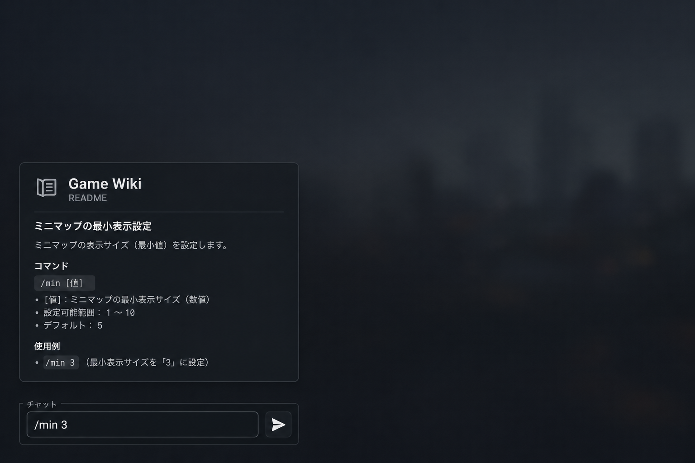

# jp-timer

RP 用の左側カウントダウン表示。`/min [分]` で開始、`/minstop` で停止。依存なし（client + NUI のみ）。

## 使い方

| コマンド   | 説明                          |
| ---------- | ----------------------------- |
| `/min 3`   | 3 分のカウントダウンを開始   |
| `/minstop` | 表示中のタイマーを止める     |

- 1〜60 分を指定
- 残り 30 秒でオレンジ、10 秒で赤、0'00 から 10 秒は赤点滅のあとフェードアウト

`server.cfg` 例: `ensure jp-timer`

## スクリーンショット

### コマンド入力画面

### タイマー実行

> 上記は説明用の代表画像です。実プレイのキャプチャに差し替えて使ってください。

## 配置

`resources/[jp-mods]/jp-timer/`

## ライセンス

本リポジトリ方針に従い、JP-Mods 用フリー MOD として利用可。
